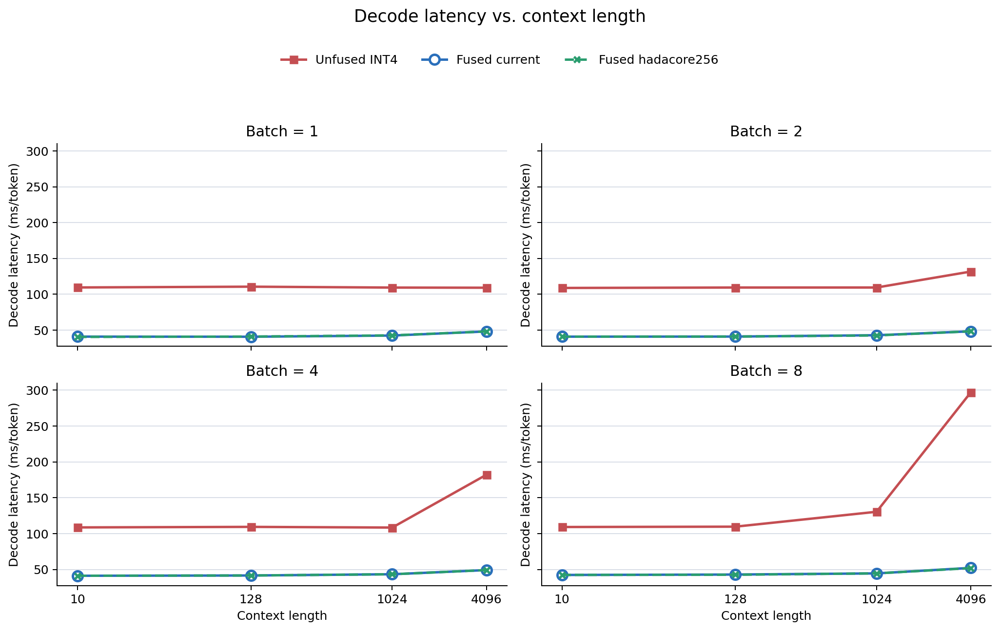
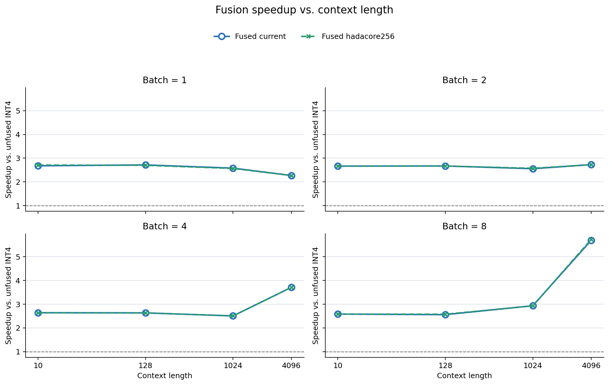
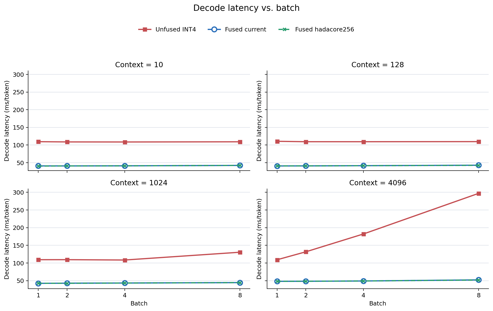
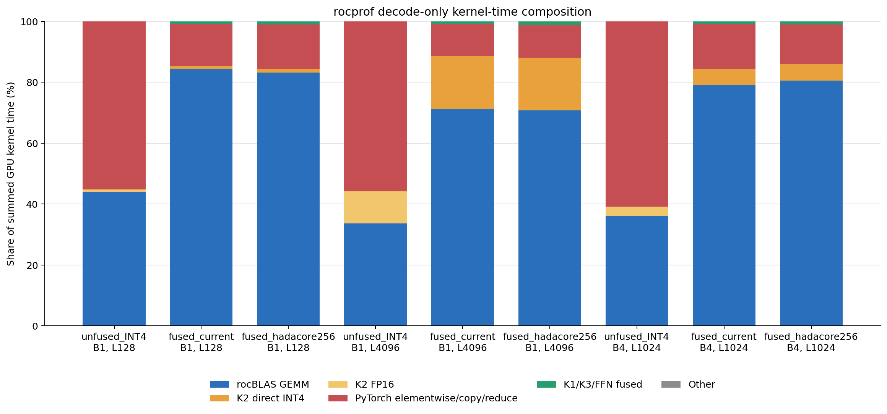
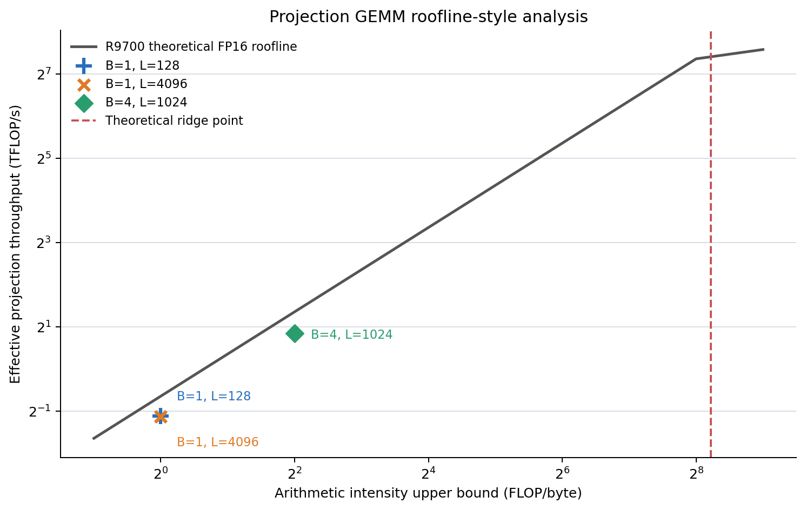

# QuaRot Decode Bottleneck 完整 Profiling 報告

日期：2026-07-14

## 實驗定位

本報告比較目前 `unfused_INT4` reference、`fused_current` 與 `fused_hadacore256` 的 Llama-3.1 8B token-by-token decode。所有 speedup 均以 `unfused_INT4` 為 baseline。`unfused_INT4` 尚不是經完整 QuaRot 權重旋轉與 calibration 的官方 converted model。

## 實驗環境

- GPU：`gfx1201`
- PyTorch：`2.9.1+git5bc97ba`
- HIP：`7.2.26015-fc0010cf6a`
- Git commit：`2418e7e0eea8c49a0b5c9b1a7a04733f32856fde`；工作目錄可能含未提交修改。

## Benchmark 方法

模型載入、HF prefill、INT4 cache conversion 與 warmup 均排除於 decode event timing。固定 context benchmark 重複覆寫同一 decode slot，因此每次 iteration 看到相同有效長度；sequential benchmark 則正常逐 token 擴展 active cache view。

Full grid 使用 3 sessions × 5 repeats，每個 repeat warmup 10、timed iterations 50，共 15 個 sample/shape/backend。Stage pass 使用 3 iterations；ablation 使用 3 repeats × 20 iterations；rocprof raw trace 每 workload 收 3 個 selected-region decode iterations。

## 主要發現

- `fused_current` 在 16 個 shape 的 speedup 為 2.27x–5.69x，平均 2.88x；最大值出現在 B=8, L=4096。
- `fused_hadacore256` 相對 current 的平均 latency ratio 為 1.001x；差距落在約 1% 內，不足以支持替換 default backend。
- Stage pass 中 unfused 的 quantization 占 stage sum 58.3%–61.0%；fusion 後 projection 成為主項，占 64.1%–67.3%。由於 stage instrumentation overhead 超過 5%，這些數字只作比例歸因。
- rocprof selected-region trace 顯示 estimated launch/host gap 約占 36.4%–68.6%；fused path 已把瓶頸從 reference Hadamard/quant/dequant 轉移到 rocBLAS projection、LM head與 dispatch overhead。

## Correctness

| variant | batch | context_len | max_error | mean_error | mean_relative_error | top1_match | top10_overlap | has_nan_or_inf |
| --- | --- | --- | --- | --- | --- | --- | --- | --- |
| fused_current | 1 | 128 | 1.2265625 | 0.20470452308654785 | 1.8396466970443726 | 1.0 | 0.9 | 0 |
| fused_hadacore256 | 1 | 128 | 1.328125 | 0.1889793425798416 | 1.189345121383667 | 1.0 | 0.9 | 0 |
| fused_current | 1 | 4096 | 0.994140625 | 0.129346564412117 | 0.7003485560417175 | 1.0 | 1.0 | 0 |
| fused_hadacore256 | 1 | 4096 | 0.822265625 | 0.13076815009117126 | 1.0268425941467285 | 1.0 | 1.0 | 0 |
| fused_current | 4 | 1024 | 1.12890625 | 0.14014708995819092 | 0.8702250123023987 | 1.0 | 0.95 | 0 |
| fused_hadacore256 | 4 | 1024 | 0.95703125 | 0.13734903931617737 | 0.9768295288085938 | 1.0 | 0.975 | 0 |

## Full-grid Decode Latency

| B | L | variant | mean ms/token | p50 | p95 | CV % | speedup vs unfused_INT4 |
| --- | --- | --- | --- | --- | --- | --- | --- |
| 1 | 10 | fused_current | 40.898 | 40.436 | 42.626 | 2.507 | 2.677 |
| 1 | 10 | fused_hadacore256 | 40.428 | 40.428 | 40.454 | 0.047 | 2.708 |
| 1 | 10 | unfused_INT4 | 109.479 | 109.711 | 110.825 | 1.028 | 1.000 |
| 1 | 128 | fused_current | 40.717 | 40.618 | 41.104 | 0.498 | 2.715 |
| 1 | 128 | fused_hadacore256 | 40.964 | 40.671 | 41.955 | 1.275 | 2.699 |
| 1 | 128 | unfused_INT4 | 110.566 | 109.679 | 113.476 | 1.806 | 1.000 |
| 1 | 1024 | fused_current | 42.377 | 42.289 | 42.880 | 0.560 | 2.579 |
| 1 | 1024 | fused_hadacore256 | 42.603 | 42.327 | 43.611 | 2.551 | 2.566 |
| 1 | 1024 | unfused_INT4 | 109.306 | 109.385 | 111.052 | 1.087 | 1.000 |
| 1 | 4096 | fused_current | 48.082 | 48.090 | 48.107 | 0.045 | 2.269 |
| 1 | 4096 | fused_hadacore256 | 48.127 | 48.110 | 48.263 | 0.162 | 2.267 |
| 1 | 4096 | unfused_INT4 | 109.109 | 108.783 | 110.194 | 0.634 | 1.000 |
| 2 | 10 | fused_current | 40.833 | 40.818 | 40.911 | 0.166 | 2.664 |
| 2 | 10 | fused_hadacore256 | 40.836 | 40.838 | 40.858 | 0.049 | 2.664 |
| 2 | 10 | unfused_INT4 | 108.796 | 108.273 | 110.495 | 1.118 | 1.000 |
| 2 | 128 | fused_current | 40.955 | 40.990 | 41.006 | 0.143 | 2.670 |
| 2 | 128 | fused_hadacore256 | 40.980 | 41.009 | 41.026 | 0.129 | 2.669 |
| 2 | 128 | unfused_INT4 | 109.369 | 109.477 | 110.713 | 0.889 | 1.000 |
| 2 | 1024 | fused_current | 42.830 | 42.502 | 44.878 | 2.043 | 2.554 |
| 2 | 1024 | fused_hadacore256 | 42.525 | 42.524 | 42.549 | 0.044 | 2.572 |
| 2 | 1024 | unfused_INT4 | 109.390 | 109.162 | 110.733 | 0.978 | 1.000 |
| 2 | 4096 | fused_current | 48.260 | 48.251 | 48.323 | 0.090 | 2.728 |
| 2 | 4096 | fused_hadacore256 | 48.309 | 48.307 | 48.362 | 0.081 | 2.725 |
| 2 | 4096 | unfused_INT4 | 131.657 | 131.609 | 131.807 | 0.072 | 1.000 |
| 4 | 10 | fused_current | 41.143 | 41.141 | 41.161 | 0.031 | 2.640 |
| 4 | 10 | fused_hadacore256 | 41.169 | 41.164 | 41.199 | 0.054 | 2.638 |
| 4 | 10 | unfused_INT4 | 108.610 | 109.026 | 109.610 | 1.164 | 1.000 |
| 4 | 128 | fused_current | 41.528 | 41.443 | 41.843 | 0.805 | 2.633 |
| 4 | 128 | fused_hadacore256 | 41.525 | 41.465 | 41.769 | 0.604 | 2.633 |
| 4 | 128 | unfused_INT4 | 109.352 | 109.598 | 110.387 | 1.065 | 1.000 |
| 4 | 1024 | fused_current | 43.275 | 43.062 | 44.260 | 1.543 | 2.505 |
| 4 | 1024 | fused_hadacore256 | 43.243 | 43.084 | 43.819 | 1.437 | 2.507 |
| 4 | 1024 | unfused_INT4 | 108.402 | 108.095 | 110.605 | 1.380 | 1.000 |
| 4 | 4096 | fused_current | 49.068 | 49.058 | 49.126 | 0.071 | 3.712 |
| 4 | 4096 | fused_hadacore256 | 49.101 | 49.104 | 49.166 | 0.080 | 3.709 |
| 4 | 4096 | unfused_INT4 | 182.132 | 182.102 | 182.206 | 0.030 | 1.000 |
| 8 | 10 | fused_current | 42.263 | 42.257 | 42.302 | 0.080 | 2.583 |
| 8 | 10 | fused_hadacore256 | 42.288 | 42.288 | 42.327 | 0.063 | 2.581 |
| 8 | 10 | unfused_INT4 | 109.161 | 109.223 | 110.780 | 0.969 | 1.000 |
| 8 | 128 | fused_current | 42.859 | 42.539 | 44.865 | 1.964 | 2.558 |
| 8 | 128 | fused_hadacore256 | 42.559 | 42.557 | 42.584 | 0.034 | 2.576 |
| 8 | 128 | unfused_INT4 | 109.642 | 109.542 | 111.388 | 0.986 | 1.000 |
| 8 | 1024 | fused_current | 44.453 | 44.444 | 44.502 | 0.062 | 2.934 |
| 8 | 1024 | fused_hadacore256 | 44.494 | 44.459 | 44.579 | 0.140 | 2.932 |
| 8 | 1024 | unfused_INT4 | 130.442 | 130.490 | 130.917 | 0.334 | 1.000 |
| 8 | 4096 | fused_current | 52.176 | 51.997 | 53.119 | 0.997 | 5.694 |
| 8 | 4096 | fused_hadacore256 | 51.815 | 51.791 | 51.932 | 0.141 | 5.734 |
| 8 | 4096 | unfused_INT4 | 297.088 | 297.066 | 297.186 | 0.020 | 1.000 |

## Batch、Context 與 Variant Scaling

下列折線圖使用無 instrumentation 的 HIP event latency。Context 圖顯示長序列主要增加 K2 cache scan；batch 圖則顯示 projection 權重可在同一次 GEMM 中由多個 token 共用，因此 fused path 在 B=1–8 的 latency 成長遠低於工作量成長。

| 變因 | 固定 shape | variant | 起點 ms | 終點 ms | latency ratio |
| --- | --- | --- | --- | --- | --- |
| context 10->4096 | B=1 | unfused_INT4 | 109.479 | 109.109 | 0.997 |
| context 10->4096 | B=1 | fused_current | 40.898 | 48.082 | 1.176 |
| context 10->4096 | B=1 | fused_hadacore256 | 40.428 | 48.127 | 1.190 |
| context 10->4096 | B=2 | unfused_INT4 | 108.796 | 131.657 | 1.210 |
| context 10->4096 | B=2 | fused_current | 40.833 | 48.260 | 1.182 |
| context 10->4096 | B=2 | fused_hadacore256 | 40.836 | 48.309 | 1.183 |
| context 10->4096 | B=4 | unfused_INT4 | 108.610 | 182.132 | 1.677 |
| context 10->4096 | B=4 | fused_current | 41.143 | 49.068 | 1.193 |
| context 10->4096 | B=4 | fused_hadacore256 | 41.169 | 49.101 | 1.193 |
| context 10->4096 | B=8 | unfused_INT4 | 109.161 | 297.088 | 2.722 |
| context 10->4096 | B=8 | fused_current | 42.263 | 52.176 | 1.235 |
| context 10->4096 | B=8 | fused_hadacore256 | 42.288 | 51.815 | 1.225 |
| batch 1->8 | L=10 | unfused_INT4 | 109.479 | 109.161 | 0.997 |
| batch 1->8 | L=10 | fused_current | 40.898 | 42.263 | 1.033 |
| batch 1->8 | L=10 | fused_hadacore256 | 40.428 | 42.288 | 1.046 |
| batch 1->8 | L=128 | unfused_INT4 | 110.566 | 109.642 | 0.992 |
| batch 1->8 | L=128 | fused_current | 40.717 | 42.859 | 1.053 |
| batch 1->8 | L=128 | fused_hadacore256 | 40.964 | 42.559 | 1.039 |
| batch 1->8 | L=1024 | unfused_INT4 | 109.306 | 130.442 | 1.193 |
| batch 1->8 | L=1024 | fused_current | 42.377 | 44.453 | 1.049 |
| batch 1->8 | L=1024 | fused_hadacore256 | 42.603 | 44.494 | 1.044 |
| batch 1->8 | L=4096 | unfused_INT4 | 109.109 | 297.088 | 2.723 |
| batch 1->8 | L=4096 | fused_current | 48.082 | 52.176 | 1.085 |
| batch 1->8 | L=4096 | fused_hadacore256 | 48.127 | 51.815 | 1.077 |

`fused_current` 在 B=1 時由 L=10 增至 4096，latency 僅由約 40.90 ms 增至 48.08 ms，額外成本主要來自讀取更長 KV cache。相反地，B=8,L=4096 的 unfused reference 因 dequant temporary、elementwise 與 dispatch 成本急升至約 297.09 ms，使 fused speedup 放大到 5.69x；這是 baseline overhead 被移除的效果，不是 fused GEMM 本身變快 5.69 倍。

## Sequential 32-token Decode

| batch | initial_context_len | variant | decode_ms_per_token | tokens_per_second | speedup_vs_unfused_INT4 |
| --- | --- | --- | --- | --- | --- |
| 1 | 128 | unfused_INT4 | 110.54571533203125 | 9.046031291185145 | 1.000 |
| 1 | 128 | fused_current | 40.82387924194336 | 24.495467323756383 | 2.708 |
| 1 | 128 | fused_hadacore256 | 40.74576950073242 | 24.54242519538193 | 2.713 |
| 1 | 4096 | unfused_INT4 | 110.51557922363281 | 9.048498021952714 | 1.000 |
| 1 | 4096 | fused_current | 48.02448654174805 | 20.82271091291507 | 2.301 |
| 1 | 4096 | fused_hadacore256 | 48.106327056884766 | 20.787286437759427 | 2.297 |

## Stage Bottleneck Breakdown

| batch | context_len | variant | category | total_ms_per_token | percent_of_stage_sum | saved_ms_vs_unfused_INT4 | instrumentation_overhead_percent |
| --- | --- | --- | --- | --- | --- | --- | --- |
| 1 | 128 | fused_current | attention | 4.604 | 7.896 | 0.472 | 153.663 |
| 1 | 128 | fused_current | norm_residual | 4.435 | 7.606 | -0.320 | 153.663 |
| 1 | 128 | fused_current | other | 0.154 | 0.264 | 0.021 | 153.663 |
| 1 | 128 | fused_current | projection | 39.261 | 67.328 | 3.889 | 153.663 |
| 1 | 128 | fused_current | quantization | 9.859 | 16.907 | 69.187 | 153.663 |
| 1 | 128 | fused_hadacore256 | attention | 4.515 | 7.838 | 0.561 | 54.943 |
| 1 | 128 | fused_hadacore256 | norm_residual | 4.334 | 7.523 | -0.220 | 54.943 |
| 1 | 128 | fused_hadacore256 | other | 0.132 | 0.229 | 0.042 | 54.943 |
| 1 | 128 | fused_hadacore256 | projection | 38.703 | 67.180 | 4.446 | 54.943 |
| 1 | 128 | fused_hadacore256 | quantization | 9.926 | 17.229 | 69.120 | 54.943 |
| 1 | 128 | unfused_INT4 | attention | 5.076 | 3.858 | 0.000 | 22.587 |
| 1 | 128 | unfused_INT4 | norm_residual | 4.115 | 3.128 | 0.000 | 22.587 |
| 1 | 128 | unfused_INT4 | other | 0.175 | 0.133 | 0.000 | 22.587 |
| 1 | 128 | unfused_INT4 | projection | 43.149 | 32.798 | 0.000 | 22.587 |
| 1 | 128 | unfused_INT4 | quantization | 79.046 | 60.083 | 0.000 | 22.587 |
| 1 | 4096 | fused_current | attention | 11.658 | 19.498 | 2.493 | 32.915 |
| 1 | 4096 | fused_current | norm_residual | 4.260 | 7.126 | -1.860 | 32.915 |
| 1 | 4096 | fused_current | other | 0.156 | 0.261 | -0.107 | 32.915 |
| 1 | 4096 | fused_current | projection | 38.326 | 64.103 | 0.565 | 32.915 |
| 1 | 4096 | fused_current | quantization | 5.388 | 9.012 | 72.320 | 32.915 |
| 1 | 4096 | fused_hadacore256 | attention | 11.593 | 19.447 | 2.557 | 32.997 |
| 1 | 4096 | fused_hadacore256 | norm_residual | 4.114 | 6.901 | -1.713 | 32.997 |
| 1 | 4096 | fused_hadacore256 | other | 0.158 | 0.266 | -0.110 | 32.997 |
| 1 | 4096 | fused_hadacore256 | projection | 38.350 | 64.328 | 0.542 | 32.997 |
| 1 | 4096 | fused_hadacore256 | quantization | 5.400 | 9.058 | 72.308 | 32.997 |
| 1 | 4096 | unfused_INT4 | attention | 14.150 | 10.624 | 0.000 | 22.178 |
| 1 | 4096 | unfused_INT4 | norm_residual | 2.400 | 1.802 | 0.000 | 22.178 |
| 1 | 4096 | unfused_INT4 | other | 0.049 | 0.037 | 0.000 | 22.178 |
| 1 | 4096 | unfused_INT4 | projection | 38.892 | 29.198 | 0.000 | 22.178 |
| 1 | 4096 | unfused_INT4 | quantization | 77.708 | 58.340 | 0.000 | 22.178 |
| 4 | 1024 | fused_current | attention | 6.318 | 10.553 | 0.339 | 51.336 |
| 4 | 1024 | fused_current | norm_residual | 4.590 | 7.667 | -1.345 | 51.336 |
| 4 | 1024 | fused_current | other | 0.173 | 0.288 | -0.121 | 51.336 |
| 4 | 1024 | fused_current | projection | 39.562 | 66.077 | 2.128 | 51.336 |
| 4 | 1024 | fused_current | quantization | 9.229 | 15.415 | 71.627 | 51.336 |
| 4 | 1024 | fused_hadacore256 | attention | 5.811 | 9.898 | 0.847 | 48.064 |
| 4 | 1024 | fused_hadacore256 | norm_residual | 4.678 | 7.968 | -1.433 | 48.064 |
| 4 | 1024 | fused_hadacore256 | other | 0.165 | 0.282 | -0.114 | 48.064 |
| 4 | 1024 | fused_hadacore256 | projection | 39.409 | 67.126 | 2.280 | 48.064 |
| 4 | 1024 | fused_hadacore256 | quantization | 8.645 | 14.725 | 72.211 | 48.064 |
| 4 | 1024 | unfused_INT4 | attention | 6.658 | 5.025 | 0.000 | 27.039 |
| 4 | 1024 | unfused_INT4 | norm_residual | 3.245 | 2.449 | 0.000 | 27.039 |
| 4 | 1024 | unfused_INT4 | other | 0.051 | 0.039 | 0.000 | 27.039 |
| 4 | 1024 | unfused_INT4 | projection | 41.690 | 31.464 | 0.000 | 27.039 |
| 4 | 1024 | unfused_INT4 | quantization | 80.856 | 61.024 | 0.000 | 27.039 |

若 instrumentation overhead 超過 5%，stage event 結果只用於比例與歸因，不取代無 instrumentation latency。

## Formal-path Ablation

| batch | context_len | variant | mean | speedup_vs_unfused_INT4 |
| --- | --- | --- | --- | --- |
| 1 | 128 | attention_fused_current | 52.034 | 2.132 |
| 1 | 128 | full_fused_current | 40.601 | 2.732 |
| 1 | 128 | full_fused_hadacore256 | 40.620 | 2.731 |
| 1 | 128 | k1_fused | 74.388 | 1.491 |
| 1 | 128 | k1_k2_fused | 67.921 | 1.633 |
| 1 | 128 | unfused_INT4 | 110.917 | 1.000 |
| 1 | 4096 | attention_fused_current | 55.630 | 1.986 |
| 1 | 4096 | full_fused_current | 48.014 | 2.301 |
| 1 | 4096 | full_fused_hadacore256 | 48.053 | 2.299 |
| 1 | 4096 | k1_fused | 87.565 | 1.262 |
| 1 | 4096 | k1_k2_fused | 68.807 | 1.606 |
| 1 | 4096 | unfused_INT4 | 110.478 | 1.000 |
| 4 | 1024 | attention_fused_current | 51.867 | 2.127 |
| 4 | 1024 | full_fused_current | 43.227 | 2.552 |
| 4 | 1024 | full_fused_hadacore256 | 43.248 | 2.550 |
| 4 | 1024 | k1_fused | 83.449 | 1.322 |
| 4 | 1024 | k1_k2_fused | 68.672 | 1.606 |
| 4 | 1024 | unfused_INT4 | 110.301 | 1.000 |

## rocprofv3 Decode-only Summary

| variant | batch | context_len | event_ms_per_token | gpu_busy_union_ms_per_token | estimated_launch_gap_ms | gpu_busy_percent_of_event | kernel_calls_per_token |
| --- | --- | --- | --- | --- | --- | --- | --- |
| fused_current | 1 | 128 | 57.314 | 36.134 | 21.180 | 63.045 | 2164.000 |
| fused_current | 1 | 4096 | 67.545 | 42.939 | 24.606 | 63.571 | 2164.000 |
| fused_current | 4 | 1024 | 69.671 | 40.095 | 29.577 | 57.548 | 2164.000 |
| fused_hadacore256 | 1 | 128 | 60.649 | 37.001 | 23.648 | 61.009 | 2164.000 |
| fused_hadacore256 | 1 | 4096 | 70.648 | 44.193 | 26.455 | 62.553 | 2164.000 |
| fused_hadacore256 | 4 | 1024 | 61.761 | 37.995 | 23.767 | 61.519 | 2164.000 |
| unfused_INT4 | 1 | 128 | 237.703 | 74.651 | 163.052 | 31.405 | 10996.000 |
| unfused_INT4 | 1 | 4096 | 225.091 | 95.216 | 129.874 | 42.301 | 10996.000 |
| unfused_INT4 | 4 | 1024 | 217.052 | 89.948 | 127.103 | 41.441 | 10995.667 |

### Kernel category breakdown

| workload | category | calls_per_token | kernel_sum_ms_per_token | percent_of_kernel_sum |
| --- | --- | --- | --- | --- |
| fused_current_B1_L128 | K2_INT4 | 32.000 | 0.411 | 1.063 |
| fused_current_B1_L128 | PyTorch_elementwise_copy_reduce | 1809.000 | 5.315 | 13.748 |
| fused_current_B1_L128 | rocBLAS_GEMM | 226.000 | 32.574 | 84.263 |
| fused_current_B1_L4096 | K2_INT4 | 32.000 | 8.001 | 17.393 |
| fused_current_B1_L4096 | PyTorch_elementwise_copy_reduce | 1809.000 | 4.933 | 10.723 |
| fused_current_B1_L4096 | rocBLAS_GEMM | 226.000 | 32.718 | 71.120 |
| fused_current_B4_L1024 | K2_INT4 | 32.000 | 2.279 | 5.411 |
| fused_current_B4_L1024 | PyTorch_elementwise_copy_reduce | 1809.000 | 6.161 | 14.626 |
| fused_current_B4_L1024 | rocBLAS_GEMM | 226.000 | 33.304 | 79.071 |
| fused_hadacore256_B1_L128 | K2_INT4 | 32.000 | 0.476 | 1.215 |
| fused_hadacore256_B1_L128 | PyTorch_elementwise_copy_reduce | 1809.000 | 5.721 | 14.599 |
| fused_hadacore256_B1_L128 | rocBLAS_GEMM | 226.000 | 32.571 | 83.121 |
| fused_hadacore256_B1_L4096 | K2_INT4 | 32.000 | 8.042 | 17.295 |
| fused_hadacore256_B1_L4096 | PyTorch_elementwise_copy_reduce | 1809.000 | 5.006 | 10.766 |
| fused_hadacore256_B1_L4096 | rocBLAS_GEMM | 226.000 | 32.888 | 70.727 |
| fused_hadacore256_B4_L1024 | K2_INT4 | 32.000 | 2.271 | 5.536 |
| fused_hadacore256_B4_L1024 | PyTorch_elementwise_copy_reduce | 1809.000 | 5.316 | 12.962 |
| fused_hadacore256_B4_L1024 | rocBLAS_GEMM | 226.000 | 33.024 | 80.519 |
| unfused_INT4_B1_L128 | K2_FP16 | 32.000 | 0.587 | 0.761 |
| unfused_INT4_B1_L128 | PyTorch_elementwise_copy_reduce | 10737.000 | 42.591 | 55.197 |
| unfused_INT4_B1_L128 | rocBLAS_GEMM | 226.000 | 33.980 | 44.037 |
| unfused_INT4_B1_L4096 | K2_FP16 | 32.000 | 10.839 | 10.606 |
| unfused_INT4_B1_L4096 | PyTorch_elementwise_copy_reduce | 10737.000 | 57.017 | 55.792 |
| unfused_INT4_B1_L4096 | rocBLAS_GEMM | 226.000 | 34.336 | 33.598 |
| unfused_INT4_B4_L1024 | K2_FP16 | 32.000 | 2.861 | 2.979 |
| unfused_INT4_B4_L1024 | PyTorch_elementwise_copy_reduce | 10736.667 | 58.417 | 60.844 |
| unfused_INT4_B4_L1024 | rocBLAS_GEMM | 226.000 | 34.728 | 36.171 |

### Top kernels

| workload | rank | category | kernel | calls_per_token | total_ms_per_token | average_us | lds_block_bytes | vgpr_count | scratch_bytes |
| --- | --- | --- | --- | --- | --- | --- | --- | --- | --- |
| fused_current_B1_L128 | 1 | rocBLAS_GEMM | Cijk_Alik_Bljk_HHS_BH_Bias_HA_S_SAV_UserArgs_MT128x128x32_MI16x16x1_SN_LDSB0_AFC1_AFEM1_AFEM1_AS | 161.000 | 30.758 | 191.042 | 26624 | 256 | 0 |
| fused_current_B1_L128 | 2 | rocBLAS_GEMM | Cijk_Alik_Bljk_HHS_BH_Bias_HA_S_SAV_UserArgs_MT16x16x32_MI16x16x1_SN_LDSB0_AFC1_AFEM1_AFEM1_ASEM | 64.000 | 1.810 | 28.278 | 6656 | 128 | 0 |
| fused_current_B1_L128 | 3 | PyTorch_elementwise_copy_reduce | void at::native::elementwise_kernel_manual_unroll<128, 4, at::native::gpu_kernel_impl<at::native | 129.000 | 0.534 | 4.141 | 0 | 16 | 0 |
| fused_current_B1_L4096 | 1 | rocBLAS_GEMM | Cijk_Alik_Bljk_HHS_BH_Bias_HA_S_SAV_UserArgs_MT128x128x32_MI16x16x1_SN_LDSB0_AFC1_AFEM1_AFEM1_AS | 161.000 | 30.882 | 191.814 | 26624 | 256 | 0 |
| fused_current_B1_L4096 | 2 | K2_INT4 | void flashinfer::BatchDecodeWithPagedKVGQAKernel<(flashinfer::RotaryMode)0, false, 16ul, 8ul, 16 | 32.000 | 8.001 | 250.047 | 8704 | 80 | 0 |
| fused_current_B1_L4096 | 3 | rocBLAS_GEMM | Cijk_Alik_Bljk_HHS_BH_Bias_HA_S_SAV_UserArgs_MT16x16x32_MI16x16x1_SN_LDSB0_AFC1_AFEM1_AFEM1_ASEM | 64.000 | 1.830 | 28.590 | 6656 | 128 | 0 |
| fused_current_B4_L1024 | 1 | rocBLAS_GEMM | Cijk_Alik_Bljk_HHS_BH_Bias_HA_S_SAV_UserArgs_MT128x128x32_MI16x16x1_SN_LDSB0_AFC1_AFEM1_AFEM1_AS | 161.000 | 31.299 | 194.405 | 26624 | 256 | 0 |
| fused_current_B4_L1024 | 2 | K2_INT4 | void flashinfer::BatchDecodeWithPagedKVGQAKernel<(flashinfer::RotaryMode)0, false, 16ul, 8ul, 16 | 32.000 | 2.279 | 71.218 | 8704 | 80 | 0 |
| fused_current_B4_L1024 | 3 | rocBLAS_GEMM | Cijk_Alik_Bljk_HHS_BH_Bias_HA_S_SAV_UserArgs_MT16x16x32_MI16x16x1_SN_LDSB0_AFC1_AFEM1_AFEM1_ASEM | 64.000 | 2.000 | 31.242 | 6656 | 128 | 0 |
| fused_hadacore256_B1_L128 | 1 | rocBLAS_GEMM | Cijk_Alik_Bljk_HHS_BH_Bias_HA_S_SAV_UserArgs_MT128x128x32_MI16x16x1_SN_LDSB0_AFC1_AFEM1_AFEM1_AS | 161.000 | 30.746 | 190.971 | 26624 | 256 | 0 |
| fused_hadacore256_B1_L128 | 2 | rocBLAS_GEMM | Cijk_Alik_Bljk_HHS_BH_Bias_HA_S_SAV_UserArgs_MT16x16x32_MI16x16x1_SN_LDSB0_AFC1_AFEM1_AFEM1_ASEM | 64.000 | 1.819 | 28.416 | 6656 | 128 | 0 |
| fused_hadacore256_B1_L128 | 3 | PyTorch_elementwise_copy_reduce | void at::native::elementwise_kernel_manual_unroll<128, 4, at::native::gpu_kernel_impl_nocast<at: | 128.000 | 0.570 | 4.450 | 0 | 24 | 0 |
| fused_hadacore256_B1_L4096 | 1 | rocBLAS_GEMM | Cijk_Alik_Bljk_HHS_BH_Bias_HA_S_SAV_UserArgs_MT128x128x32_MI16x16x1_SN_LDSB0_AFC1_AFEM1_AFEM1_AS | 161.000 | 31.027 | 192.712 | 26624 | 256 | 0 |
| fused_hadacore256_B1_L4096 | 2 | K2_INT4 | void flashinfer::BatchDecodeWithPagedKVGQAKernel<(flashinfer::RotaryMode)0, false, 16ul, 8ul, 16 | 32.000 | 8.042 | 251.315 | 8704 | 80 | 0 |
| fused_hadacore256_B1_L4096 | 3 | rocBLAS_GEMM | Cijk_Alik_Bljk_HHS_BH_Bias_HA_S_SAV_UserArgs_MT16x16x32_MI16x16x1_SN_LDSB0_AFC1_AFEM1_AFEM1_ASEM | 64.000 | 1.855 | 28.984 | 6656 | 128 | 0 |
| fused_hadacore256_B4_L1024 | 1 | rocBLAS_GEMM | Cijk_Alik_Bljk_HHS_BH_Bias_HA_S_SAV_UserArgs_MT128x128x32_MI16x16x1_SN_LDSB0_AFC1_AFEM1_AFEM1_AS | 161.000 | 31.189 | 193.718 | 26624 | 256 | 0 |
| fused_hadacore256_B4_L1024 | 2 | K2_INT4 | void flashinfer::BatchDecodeWithPagedKVGQAKernel<(flashinfer::RotaryMode)0, false, 16ul, 8ul, 16 | 32.000 | 2.271 | 70.956 | 8704 | 80 | 0 |
| fused_hadacore256_B4_L1024 | 3 | rocBLAS_GEMM | Cijk_Alik_Bljk_HHS_BH_Bias_HA_S_SAV_UserArgs_MT16x16x32_MI16x16x1_SN_LDSB0_AFC1_AFEM1_AFEM1_ASEM | 64.000 | 1.829 | 28.586 | 6656 | 128 | 0 |
| unfused_INT4_B1_L128 | 1 | rocBLAS_GEMM | Cijk_Alik_Bljk_HHS_BH_Bias_HA_S_SAV_UserArgs_MT128x128x32_MI16x16x1_SN_LDSB0_AFC1_AFEM1_AFEM1_AS | 161.000 | 32.118 | 199.493 | 26624 | 256 | 0 |
| unfused_INT4_B1_L128 | 2 | PyTorch_elementwise_copy_reduce | void at::native::elementwise_kernel_manual_unroll<128, 8, at::native::gpu_kernel_impl_nocast<at: | 2816.000 | 12.644 | 4.490 | 0 | 32 | 0 |
| unfused_INT4_B1_L128 | 3 | PyTorch_elementwise_copy_reduce | void at::native::elementwise_kernel_manual_unroll<128, 4, at::native::gpu_kernel_impl_nocast<at: | 1216.000 | 5.440 | 4.473 | 0 | 24 | 0 |
| unfused_INT4_B1_L4096 | 1 | rocBLAS_GEMM | Cijk_Alik_Bljk_HHS_BH_Bias_HA_S_SAV_UserArgs_MT128x128x32_MI16x16x1_SN_LDSB0_AFC1_AFEM1_AFEM1_AS | 161.000 | 32.501 | 201.869 | 26624 | 256 | 0 |
| unfused_INT4_B1_L4096 | 2 | PyTorch_elementwise_copy_reduce | void at::native::elementwise_kernel_manual_unroll<128, 4, at::native::gpu_kernel_impl_nocast<at: | 1216.000 | 13.029 | 10.715 | 0 | 24 | 0 |
| unfused_INT4_B1_L4096 | 3 | PyTorch_elementwise_copy_reduce | void at::native::elementwise_kernel_manual_unroll<128, 8, at::native::gpu_kernel_impl_nocast<at: | 2816.000 | 11.779 | 4.183 | 0 | 32 | 0 |
| unfused_INT4_B4_L1024 | 1 | rocBLAS_GEMM | Cijk_Alik_Bljk_HHS_BH_Bias_HA_S_SAV_UserArgs_MT128x128x32_MI16x16x1_SN_LDSB0_AFC1_AFEM1_AFEM1_AS | 161.000 | 32.885 | 204.253 | 26624 | 256 | 0 |
| unfused_INT4_B4_L1024 | 2 | PyTorch_elementwise_copy_reduce | void at::native::elementwise_kernel_manual_unroll<128, 4, at::native::gpu_kernel_impl_nocast<at: | 1216.000 | 14.405 | 11.846 | 0 | 24 | 0 |
| unfused_INT4_B4_L1024 | 3 | PyTorch_elementwise_copy_reduce | void at::native::elementwise_kernel_manual_unroll<128, 8, at::native::gpu_kernel_impl_nocast<at: | 2815.667 | 11.437 | 4.062 | 0 | 32 | 0 |

rocprofv3 在 gfx1201 上回報少量 dispatch start/end timestamp swap warnings；SDK 已交換顛倒值。因此細粒度 duration與busy union視為 profiling近似值，正式 latency仍以無 profiler HIP events為準。

## rocBLAS GEMM：Compute-bound 或 Memory-bound？

結論是：**本次 B=1–8 token decode 的 projection/LM-head GEMM 主要是 memory/weight-streaming bound，不是 matrix compute-bound**。Kernel 使用 rocBLAS 與 matrix instruction 只描述實作方式，不代表已吃滿計算單元。

Llama-3.1 8B 每 token 的 32 層 Q/K/V/O、gate/up/down 與 LM head 合計約讀取 75 億個 FP16 weight，理論最低約 15.0 GB。若忽略 activation、output、cache miss 與重讀，arithmetic intensity 上限約等於 batch：B=1 為 1 FLOP/byte，B=4 為 4 FLOP/byte。AMD 官方規格為 FP16 matrix 191 TFLOP/s、memory 640 GB/s，理論 ridge point 約 298.4 FLOP/byte；目前測試點遠在 bandwidth 斜坡左側。

| B | L | rocBLAS ms | FP16 weight lower bound GB | AI upper bound | effective TFLOP/s | effective weight GB/s | % of 640 GB/s |
| --- | --- | --- | --- | --- | --- | --- | --- |
| 1 | 128 | 32.574 | 15.009 | 1.000 | 0.461 | 460.782 | 71.997 |
| 1 | 4096 | 32.718 | 15.009 | 1.000 | 0.459 | 458.750 | 71.680 |
| 4 | 1024 | 33.304 | 15.009 | 4.000 | 1.803 | 450.671 | 70.417 |

另一個直接證據是 batch scaling：rocprof 中 `fused_current` 的 rocBLAS kernel sum 從 B=1,L=128 的約 32.57 ms，到 B=4,L=1024 只有約 33.30 ms，但 algorithmic FLOPs 增加 4 倍。這表示同一批 weight 被四個 token 攤提，effective TFLOP/s 隨 batch 提升，而時間近乎不變；若已 compute-bound，時間通常會更接近隨 FLOPs 增長。這個分類適用於目前 B<=8；更大的 batch 會提高 arithmetic intensity，最終可能轉為 compute-bound。

長 context 的次要瓶頸 K2 也偏 memory-bound：B=1 時 direct INT4 K2 kernel sum 由 L=128 的約 0.41 ms 增至 L=4096 的約 8.00 ms，占 fused kernel sum 從 1.1% 升至 17.4%。其工作量與 KV cache bytes 都近似隨 L 線性增加；GQA 讓 32 個 query heads 共用 8 個 KV heads，降低 cache traffic，但不改變長序列 cache scan 的 bandwidth 性質。剩餘 PyTorch elementwise/copy/reduction 多為低 arithmetic intensity 與 launch-sensitive，同樣不是主要 compute-bound 項。

硬體峰值來源：[AMD Radeon AI PRO R9700 官方規格](https://www.amd.com/en/products/graphics/workstations/radeon-ai-pro/ai-9000-series/amd-radeon-ai-pro-r9700.html)。上述 effective bandwidth 是由 FP16 weight 最低 bytes / rocprof kernel time 推估，不是 GL2C/DRAM counter 實測值。

## Counters、Traffic 與 Throughput

| workload | counter | samples | nonzero_samples | sum | status |
| --- | --- | --- | --- | --- | --- |
| fused_current_B1_L128_probe0 | FetchSize | 16423 | 0 | 0.000 | all_zero |
| fused_current_B1_L128_probe1 | GL2C_EA_RDREQ_64B_sum | 16423 | 0 | 0.000 | all_zero |
| fused_current_B1_L128_probe1 | GL2C_EA_WRREQ_64B_sum | 16423 | 0 | 0.000 | all_zero |
| fused_current_B1_L128_probe2 | SQC_LDS_BANK_CONFLICT | 16423 | 0 | 0.000 | all_zero |
| fused_current_B1_L128_probe2 | SQC_LDS_IDX_ACTIVE | 16423 | 0 | 0.000 | all_zero |
| fused_current_B1_L128_probe2 | SQ_INSTS_LDS | 16423 | 0 | 0.000 | all_zero |
| fused_current_B1_L128_probe3 | MeanOccupancyPerCU | 16423 | 0 | 0.000 | all_zero |

Working counter set 的 `SQ_WAVES_sum`、`GRBM_GUI_ACTIVE`、`GRBM_COUNT`、`CU_NUM`、`SIMD_NUM` 有非零值；完整逐 workload 數據見 `counter_summary.csv`。

Counter collection 的 dispatch sample count 與 raw selected-region trace 不完全一致，因此 counter只用於確認支援/非零狀態，不換算每 token utilization。

### K2 理論最小 traffic

| batch | context_len | variant | minimum_semantic_bytes_all_layers | stage_ms_per_token | effective_minimum_bandwidth_GBps |
| --- | --- | --- | --- | --- | --- |
| 1 | 128 | fused_current | 4491264.000 | 1.033 | 4.348 |
| 1 | 4096 | fused_current | 142641152.000 | 8.085 | 17.643 |
| 4 | 1024 | fused_current | 142745600.000 | 2.476 | 57.648 |
| 1 | 128 | fused_hadacore256 | 4491264.000 | 1.039 | 4.323 |
| 1 | 4096 | fused_hadacore256 | 142641152.000 | 8.105 | 17.600 |
| 4 | 1024 | fused_hadacore256 | 142745600.000 | 2.483 | 57.481 |
| 1 | 128 | unfused_INT4 | 38307840.000 | 7.238 | 5.293 |
| 1 | 4096 | unfused_INT4 | 1216645120.000 | 30.827 | 39.467 |
| 4 | 1024 | unfused_INT4 | 1217536000.000 | 25.437 | 47.865 |

### Effective throughput（B=1, L=128）

| variant | stage | metric | algorithmic_ops | stage_ms | value |
| --- | --- | --- | --- | --- | --- |
| fused_current | q_proj | effective_TFLOPs | 1073741824 | 2.614 | 0.411 |
| fused_current | gate_proj | effective_TFLOPs | 3758096384 | 10.094 | 0.372 |
| fused_current | down_proj_residual | effective_TFLOPs | 3758096384 | 8.225 | 0.457 |
| fused_current | K1 | effective_Hadamard_TOPS | 458752 | 0.924 | 0.000 |
| fused_current | K3 | effective_Hadamard_TOPS | 1048576 | 1.227 | 0.001 |
| fused_current | FFN | effective_Hadamard_TOPS | 3670016 | 0.279 | 0.013 |
| fused_hadacore256 | q_proj | effective_TFLOPs | 1073741824 | 2.567 | 0.418 |
| fused_hadacore256 | gate_proj | effective_TFLOPs | 3758096384 | 10.088 | 0.373 |
| fused_hadacore256 | down_proj_residual | effective_TFLOPs | 3758096384 | 8.174 | 0.460 |
| fused_hadacore256 | K1 | effective_Hadamard_TOPS | 458752 | 0.973 | 0.000 |
| fused_hadacore256 | K3 | effective_Hadamard_TOPS | 1048576 | 1.249 | 0.001 |
| fused_hadacore256 | FFN | effective_Hadamard_TOPS | 3670016 | 0.300 | 0.012 |

gfx1201 上 GL2C、LDS 與 MeanOccupancy counters 若仍回傳 0，不解讀為零流量或零 occupancy。報告改用 kernel trace 的 LDS/VGPR/scratch、可用的 SQ/GRBM counters，以及理論 minimum semantic traffic。TFLOP/s、Hadamard TOPS 與 effective bandwidth 均為 algorithmic/effective 指標，不等同硬體峰值。

## 結論與限制

目前 unfused_INT4 的主要瓶頸是 PyTorch reference Hadamard/quant/dequant、完整 paged-cache dequant與大量 dispatch；current fusion 移除這些中間步驟後，主要成本轉為 QKV/O/MLP/LM-head GEMM、剩餘 PyTorch elementwise/copy，以及 host launch gap。長 context 下 attention占比提高，但 K1/K2/K3/FFN fused kernel 本身已不是最大 kernel-time項。hadacore256 在 full-grid、sequential與ablation中均未形成穩定優勢，因此 default仍應保持 current。

本結果代表目前 formal wrapper 的 decoder decode path，不包含完整 serving scheduler、sampling、tokenization與網路成本；`unfused_INT4` 也尚不是正式 QuaRot-converted、經 calibration 的 Llama。因此不可宣稱完整模型或 production serving 的同倍率 end-to-end speedup。
