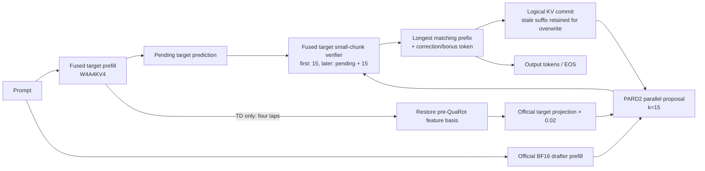

# fused_v1 × PARD2-TI/TD 整合技術報告

更新日期：2026-08-18
目前狀態：**核心 runtime 與正式 qualification 基礎設施已建立；MATH-500 顯示明確加速，但 exact greedy parity 尚未通過，因此目前不可宣告整合合格或達成文獻值。**

## 1. 摘要

本工作將 PARD2 speculative decoding 整合到 `fused_v1` 的 HIP QuaRot W4A4KV4 dense runtime。由於 `fused_v1` 對 Llama 3.1 的真實 checkpoint 支援與驗證完整度不足，第一個整合目標改為 `Qwen/Qwen3-8B`。Qwen3-8B 同時具備：

- `fused_v1` dense Qwen3 runtime；
- 可轉換並執行的 W4A4KV4 target；
- AMD 官方相容的 `PARD2-Qwen3-8B` drafter 與 TD projection；
- 可固定 revision、tokenizer、資料集與上游 PARD commit，形成可重現實驗。

目前已完成 AR、PARD2-TI、PARD2-TD 的共用 runtime、native GQA KV4 cache、provisional chunk verification、邏輯 cache commit/rollback、TD selected hidden taps、官方 BF16 drafter、`torch.compile(max-autotune)`、正式 benchmark runner 與 qualification gates。

已完成的正式 MATH-500 測試顯示：

- PARD2-TI paired median steady speedup 為 **2.238×**，95% bootstrap CI 為 **[2.133×, 2.423×]**；
- PARD2-TD paired median steady speedup 為 **1.342×**，95% bootstrap CI 為 **[1.000×, 1.587×]**；
- TI/TD 分別將平均 target forwards 從 AR 的 256 次降至 50.05 與 43.70 次；
- TI/TD peak allocated VRAM 分別為 8.53/8.61 GiB，均保留超過 72% headroom；
- 但 TI 與 TD 都在 16/20 prompts 上偏離 AR，合計 48/60 runs parity failure；TI 與 TD 彼此則為 60/60 exact match。

因此，目前數字證明架構具有加速潛力，但尚未符合 lossless speculative decoding 的必要 correctness gate。HumanEval/GSM8K 正式測試也依 fail-fast 原則暫停，避免把已知不合格的結果誤作正式結論。

## 2. 工作目標與範圍

第一版固定以下推論合約：

| 項目 | 設定 |
|---|---|
| Target | Qwen3-8B fused QuaRot W4A4KV4 |
| Batch | 1 |
| Decoding | greedy |
| Qwen3 thinking | disabled |
| PARD2 proposal width | `draft_k=15` |
| 模式 | `ar`、`pard2-ti`、`pard2-td` |
| 一般生成 | 遵守 EOS |
| 固定長度 microbenchmark | 可選 `--ignore-eos`，不得當正式結果 |
| Target checkpoint | 三種模式共用同一份 checkpoint |
| KV/cache/kernel | 三種模式共用同一套 fused runtime |

第一階段只處理 PARD2 與 `fused_v1` 本身的整合：target、drafter、small-chunk verifier、KV cache、GQA、hidden taps、編譯與計時。第二階段才允許 feature calibration、drafter 量化、adaptive-k 與 graph capture。

目前不包含 MoE、Qwen PARD2 多模型擴展、sampling 分布等價、batch serving、模型重訓或其他 speculative 方法。

## 3. 模型與資源選型

### 3.1 為何改用 Qwen3-8B

最初規劃以 Llama 3.1 8B 為 target，但進一步檢查後，`fused_v1` 對 Llama 3.1 的實際 checkpoint 相容性與端到端驗證不足。Qwen3-8B 已有較完整的 dense runtime、量化轉換路徑和官方 PARD2 checkpoint，因此改為第一個正式整合模型。

這個選擇保留了 PARD2-TI/TD 的核心研究問題，同時避免把模型支援缺口與 speculative decoding 本身混在一起。

### 3.2 Pinned resources

| 資源 | 固定版本 |
|---|---|
| Target source/tokenizer | `Qwen/Qwen3-8B@b968826d9c46dd6066d109eabc6255188de91218` |
| PARD2 drafter | `amd/PARD2-Qwen3-8B@67a1516c8f6fc145cda99916799a0cbb3a4af135` |
| AMD PARD 程式 | `6f279bf3f1680e0b5d71c562ca5b91bdeef4c038` |
| Fused target | `qwen3_8b_fused_v1_rtn_w4a4kv4` |

PARD2 模型、TD projection、target source 與 tokenizer 都使用本機 pinned Hugging Face cache；正常執行不需要重新下載或複製 checkpoint。資源檢查會驗證 `config.json`、`model.safetensors` 與 `warp_model.bin` 是否存在且大小合理，缺檔時才提示精確的 pinned `hf download` 指令。

### 3.3 固定 PARD2 規格

| 欄位 | Qwen3-8B 設定 |
|---|---:|
| `pard_token` | 151670 |
| `draft_k` | 15 |
| TD taps | `[-1, -8, -16, -24]` |
| Target layers | 36 |
| Hidden size | 4096 |
| TD concatenated dimension | 16384 |
| Projection scale | 0.02 |
| Vocabulary | 151936 |

Runtime 啟動時會檢查 model family、layer/hidden shape、vocabulary、PARD token、TD taps、projection dimension 與 scale；不相容的 checkpoint 不會進入推論。

## 4. 整體架構



AR、TI、TD 使用同一個量化 target：

- AR 每次執行一個 target token；
- TI 只使用 PARD2 drafter 的 token-side conditioning，不載入 `warp_model.bin`；
- TD 額外從 target 擷取四個 hidden taps，恢復至 PARD2 預期的 feature basis，再經官方 projection 注入 drafter embedding。

### 4.1 Speculative step

1. Target prompt prefill 保持與 AR 相同，避免把 prompt 與 candidates 合併成不同的量化 prefill 語意。
2. Target prefill 的最後 logit 成為第一輪 pending prediction。
3. Drafter 以一段真實輸入加上 PARD mask tokens，一次平行產生 15 candidates。
4. 第一輪 target 驗證 15 candidates；之後每輪驗證「上一輪 pending correction + 15 candidates」，最多 16 tokens。
5. 接受最長的 candidate/target 相同 prefix。
6. 輸出 accepted prefix 後的 target correction；若 15 candidates 全部接受，則輸出 target bonus token。
7. Cache 只保留 pending token 與已接受 prefix；未接受的 provisional slots 保留在實體 storage，下一輪直接覆寫。
8. 一般生成遇 EOS 即停止；只有明確的固定長度 microbenchmark 才忽略 EOS。

這個接受規則與官方 greedy PARD2 語意一致，不使用機率採樣或近似接受。

## 5. 核心實作

### 5.1 Runtime 與 CLI

主要入口：

- `e2e/pard2.py`：單次 AR/TI/TD generation CLI；
- `e2e/speculative.py`：PARD2 spec、runtime、acceptance、metrics、TD features；
- `e2e/benchmark_pard2.py`：每個 mode/dataset 的獨立正式程序；
- `e2e/qualify_pard2.py`：parity、CI、CV、VRAM 與文獻 gate。

`GenerationResult` 統一記錄：

- TTFT、steady decode、E2E latency；
- target/draft forwards；
- proposed/accepted tokens；
- 每輪 proposal、accept 與 emitted length；
- conditional acceptance 與逐位置 conditional acceptance；
- target/draft/prefill/verify stage 時間；
- peak allocated VRAM；
- 最終 output token IDs。

### 5.2 Native GQA KV4 cache

原 runtime 會把 8 個 KV heads 展開成 32 heads 以配合 MHA decode。整合後新增 native GQA decode：

- KV cache 永久保存原生 8 heads；
- INT4 與 FP16 paged decode 都有 GQA kernel；
- expanded-MHA 保留為 correctness oracle/ablation；
- cache 容量因此不再為重複 KV heads 支付 4× storage。

對應 HIP/C++ binding 包含 `batch_decode_i4_gqa` 與 `batch_decode_f16_gqa`。

### 5.3 Unified fused KV append

新增 fused writer，將下列工作合成單一路徑：

1. K head-wise Hadamard；
2. K/V asymmetric INT4 scale/zero 計算；
3. INT4 packing；
4. 直接寫入 paged cache 指定 slot。

同一 writer 可處理 prompt prefill、single-token decode 與 provisional chunks。非 fused 路徑仍保留作 correctness fallback。

### 5.4 Virtual causal chunk verification

Small chunk 不被當成一般大型 prefill，而是把 `B × q_len` 視為多個 virtual decode rows。每個 row 使用只到自己位置為止的 paged metadata，因此可以：

- 一次 append 整個 provisional chunk；
- 每個 query 只看見 causal prefix；
- 沿用 paged KV4 decode kernel；
- 不建立完整 dense attention mask。

`q_len=1/15/16` 都由同一 cache 介面處理。

### 5.5 Cache transaction

`CacheTransaction` 提供 `begin/commit/rollback` 與 logical length 管理。實體 provisional slots 不做清零或搬移，rollback/partial commit 只改 visible length。

由於 Transformers 有時回傳 shallow cache wrapper，目前 speculative runtime 在 verifier 回傳後直接對該實體 cache 設定等價的 committed logical length；transaction API 則由 cache 單元測試與 kernel oracle 路徑覆蓋。

### 5.6 Small-chunk W4A4 與 fused FFN

Target 的 small-chunk 路徑沿用 fused W4A4 projection、fused attention-output Hadamard/quantize 與 fused SiLU–Hadamard–quantize–down FFN。另加入可選的 `M<=16` BPre GEMM geometry：

- 以 `QUAROT_ENABLE_M16_BPRE=1` 顯式啟用；
- 維持原 checkpoint keys，不需要 checkpoint migration；
- correctness 已有 row-packed oracle 測試；
- 因 smoke E2E 未達 3% 改善，目前不作預設。

目前尚未把 Q/K/V 或 gate/up 的 checkpoint modules 重寫成單一 fused projection module；現階段優化集中在 kernel/cache/activation pipeline，保留 checkpoint 相容性。

### 5.7 Qwen3 cache 相容修正

Transformers 4.57 的 Qwen3 會以 `past_key_values` 複數名稱傳入 cache。Runtime 已正規化 singular/plural 參數，避免 Qwen3 靜默退化成每輪 cache-less prefill。

### 5.8 TD hidden features

TD 不建立完整 `hidden_states` tuple，而是只在四個指定 transformer layers 安裝 hooks。Qwen3-8B 的負索引 taps 轉為 `(35, 28, 20, 12)`，並維持 `[-1,-8,-16,-24]` 的輸出順序。

QuaRot target 的 hidden basis 與官方 BF16 PARD2 不同，因此 checkpoint converter 額外保存：

- `quarot_rotation_signs`；
- `quarot_final_norm_weight`。

TD runtime 使用這些 metadata 做 inverse Hadamard/sign restoration，並對最後一層 tap 恢復原始 final RMSNorm 語意。四個 4096-wide features 串接成 16384 維，再經官方 `target_proj` 與 0.02 scale 注入 drafter embedding。

Feature 在時間上左移一格；prompt 的第一格用 zero vector，第一輪 candidate 使用最後一個 prompt hidden state，後續輪使用 pending correction 對應的 target feature。

### 5.9 BF16 drafter compile 策略

官方 drafter 維持 BF16。任意長度 prompt prefix 使用 eager prefill，讓 compiled proposal graph 只處理由 `k=15` 與前輪 emitted length 決定的有限固定 shapes，而不依 prompt 長度無界重編譯。

正式測試採 `torch.compile(mode="max-autotune", fullgraph=True, dynamic=False)`，並使用持久 `.pard_compile_cache`。

實際 qualification 首次覆蓋多個 proposal shapes 時，發現 PyTorch 預設 `recompile_limit=8` 不足。Runtime 現在將 compiled drafter 的 budget 提升至 `draft_k+1=16`，且新增回歸測試確認 compile 合約不變。

## 6. 第二階段設施與目前採用狀態

第二階段功能都必須通過獨立 gate，預設全部關閉。

### 6.1 Feature calibration

已加入：

- `pard2_collect_features.py`：從 frozen tune split 收集 BF16/fused raw 與 projected feature pairs；
- `pard2_calibrate.py`：擬合 per-channel affine scale/bias；
- runtime 支援 raw 與 projected 兩段 calibration。

Collector 明確把 artifact 標記為 `split="tune"`，calibrator 拒絕非 tune split，避免 formal split 洩漏。

小型 held-out smoke 中，calibration 將 steady throughput 從 25.179 提升至 27.328 tok/s（+8.5%），但 E2E 從 17.897 降至 17.769 tok/s（-0.7%），因此沒有採用。

### 6.2 Drafter W4A4

已產生實驗性 W4A4 drafter artifact，但測得 mean accept length 退化至 1.0、accepted draft tokens 為 0，未通過品質 gate，保留為 ablation artifact而不採用。

### 6.3 Adaptive-k

已實作以 acceptance EMA 在 `{8,12,15}` 間選擇 k 的 selector，只有明確傳入 `--adaptive-k` 才啟用。尚未在 frozen tune split 完成參數選擇，因此不是正式配置。

### 6.4 Graph capture

尚未加入 HIP graph capture。依計畫，只有固定 shape draft/verify step 的 E2E 改善至少 3% 才會採用。

## 7. 測試與 qualification 設計

### 7.1 單元與 GPU correctness

已加入或擴充的測試包括：

- pinned model/revision/vocab/PARD token/TD shape；
- greedy acceptance 的 0、部分與全部接受；
- cache commit/rollback、非法 commit、stale storage logical semantics；
- 四個 hidden taps 的順序與 shape；
- QuaRot feature basis round trip；
- per-channel affine calibration；
- formal payload 拒絕 smoke contract；
- compiled drafter 16-shape recompile budget；
- batched KV Hadamard 與逐 row oracle；
- fused chunk writer 與 sequential slots；
- native GQA 對 expanded-MHA oracle；
- context `1/127/128/129/1024/4096`；
- provisional chunk `1/15/16`；
- M16 BPre GEMM 對 row-packed oracle。

最近一次完整核心 GPU suite 為 **110 passed**；加入 compile-budget regression 後，PARD2 focused suite 為 **12 passed**。這些測試證明 cache/kernel 局部 contract，但正式生成結果顯示仍需要補上「真實 checkpoint 的完整 target chunk logits vs sequential AR」測試。

### 7.2 正式 benchmark contract

| Dataset | Prompts | SHA-256 |
|---|---:|---|
| HumanEval | 80 | `e16580cc87cac3168e59bde4ec1d0cd5cec7f31e1506c8ee1eba2ff914cf4368` |
| GSM8K | 80 | `56767ac321f1e80e3721f390c743a6a7253d4d5f50bd791339010ffcd8620371` |
| MATH-500 | 20 | `4d8a669d746329ede429b1f4b037138ada9ae39ead6d0c34e1aa1be5349365a5` |

每個 mode/dataset 必須是獨立程序，固定：

- batch 1；
- greedy；
- 256 generated-token 上限；
- 正常 EOS；
- 8 個非計分 warmups；
- 3 個交錯且固定 seed 的 measured sweeps；
- 不允許 `--limit`/`--offset`；使用者若縮減 prompts，payload 自動標記 `qualified: false`。

Qualifier 會檢查 exact run count、contract、paired token parity、paired steady speedup、10,000-sample median bootstrap CI、sweep-level CV、peak VRAM 與文獻比例。

第一階段硬門檻為：

1. 所有正式 prompts exact greedy parity；
2. 每個 dataset 的 steady speedup 95% CI 下界大於 1.0× AR；
3. run-level CV 小於 5%；
4. peak VRAM 不超過總 VRAM 90%。

Qwen3-8B 的官方 AMD TD 參考是 HumanEval 6.75×、GSM8K 6.44×。官方表格沒有 Qwen3 MATH-500 或對應 acceptance length，因此不計算不存在的文獻達成率。

## 8. 實驗與結果

### 8.1 64-token HumanEval smoke

這是單 prompt、固定長度、`ignore_eos` 的架構 smoke，不是正式結果：

| Mode | Steady tok/s | E2E tok/s | 對 AR steady | 對 AR E2E |
|---|---:|---:|---:|---:|
| AR | 18.462 | 14.893 | 1.000× | 1.000× |
| PARD2-TD | 32.376 | 22.103 | 1.754× | 1.484× |

該 prompt AR/TD exact parity，TD mean accept length 為 4.27，peak allocated VRAM 為 8.19 GiB。它證明整個 TD pipeline 可以端到端執行並在單例上加速，但不能代表正式資料集或文獻達成率。

### 8.2 M16 kernel ablation

同一 64-token smoke：

| Verifier GEMM | Steady tok/s | E2E tok/s | 結論 |
|---|---:|---:|---|
| 預設 geometry | 32.376 | 22.103 | baseline |
| `QUAROT_ENABLE_M16_BPRE=1` | 32.505 | 21.035 | steady +0.4%，E2E -4.8% |

未達「median latency 至少改善 3%」門檻，因此 M16 專用 geometry 保留為 opt-in，不設為預設。

### 8.3 正式 MATH-500

三種模式均完成 20 prompts、8 warmups、3 sweeps，共 60 measured runs；生成遵守 EOS。

| 指標 | AR | PARD2-TI | PARD2-TD |
|---|---:|---:|---:|
| Median steady tok/s | 18.589 | 41.586 | 25.137 |
| Median E2E tok/s | 18.544 | 39.419 | 24.163 |
| Paired median steady speedup | 1.000× | **2.238×** | **1.342×** |
| Speedup 95% bootstrap CI | — | **[2.133, 2.423]** | **[1.000, 1.587]** |
| Sweep-level steady CV | 1.84% | 3.03% | **6.42%** |
| Mean accept length | 1.000 | 5.676 | 6.498 |
| Mean conditional acceptance | — | 82.48% | 85.37% |
| Mean target forwards/run | 256.00 | 50.05 | 43.70 |
| Mean draft forwards/run | 0 | 50.05 | 43.70 |
| Peak allocated VRAM | 6.04 GiB | 8.53 GiB | 8.61 GiB |
| VRAM headroom | 81.06% | 73.22% | 72.98% |

Median accumulated stage time：

| Stage | AR | PARD2-TI | PARD2-TD |
|---|---:|---:|---:|
| Target / target verify | 13,765 ms | 5,242 ms | 8,109 ms |
| Draft | — | 840 ms | 1,098 ms |
| Target prefill | included in target | 84 ms | 235 ms（含 features） |
| Draft prefill | — | 51 ms | 68 ms |

#### 速度解讀

- TI 將 target forwards 減少約 5.1×，並得到穩定的 2.24× paired steady speedup；CI、CV 與 VRAM speed/stability/resource gates 單獨看都通過。
- TD 的 acceptance 比 TI 高，但 hidden-feature collection/projection 與 target verification 成本較高；最終只有 1.34× paired speedup。
- TD 95% CI 下界僅略高於 1.0，且 CV 6.42% 超過 5% 門檻；即使先不考慮 parity，TD stability gate 也未通過。

#### Exact parity 結果

- AR：三個 sweeps 內每個 prompt 都 deterministic；
- TI：三個 sweeps 內 deterministic；
- TD：三個 sweeps 內 deterministic；
- TI vs TD：**60/60 runs exact match**；
- AR vs TI：48/60 runs mismatch；
- AR vs TD：48/60 runs mismatch；
- mismatch 對應 16/20 prompts，且每個受影響 prompt 在三個 sweeps 都重現；
- 第一個已定位 divergence：prompt 14、generated token index 171。

因此 MATH-500 的正式 qualification 結論是 **FAIL**。所有速度數字只可用於效能診斷，不可宣稱為 lossless PARD2 speedup。

## 9. 當前問題定位

TI 與 TD 的全部輸出彼此一致，且都以相同位置偏離 AR。這項證據將問題範圍縮小到兩種 speculative modes 共用的路徑，優先順序是：

1. full-target small-chunk verifier logits 是否與 sequential `q_len=1` target logits top-1 一致；
2. virtual causal paged metadata；
3. provisional KV append/visible length/partial commit；
4. M>1 與 M=1 的 W4A4 projection、fused attention output 或 FFN dispatch 差異。

目前不能只憑局部 native-GQA/expanded-MHA tensor tolerance 測試判定完整 model parity。下一輪診斷應使用真實 divergent prompt，依序執行：

1. expanded-MHA + fused append；
2. native GQA + non-fused append；
3. expanded-MHA + non-fused append；
4. 在相同 base cache 上逐位置比較 chunk logits 與 sequential logits/top-1；
5. 在第一個不同 layer/projection 擷取 M=1 與 M=15/16 中間值；
6. 對 acceptance length `0..15` 驗證 commit 後下一 token 與 fresh recomputation 一致。

只有修復 exact parity 後，現有 MATH-500 speedup 才能進入採用判定。

## 10. 階段完成度

### 第一階段：PARD2 × fused_v1 核心架構

| 項目 | 狀態 |
|---|---|
| Qwen3-8B pinned resources 與 compatibility checks | 完成 |
| 同 checkpoint AR/TI/TD runtime | 完成 |
| 官方 BF16 TI/TD drafter | 完成 |
| Native GQA INT4/FP16 decode | 完成，局部 oracle 通過 |
| Unified fused KV4 append | 完成，slot oracle 通過 |
| Virtual causal provisional chunk | 完成，尚待 full-model parity 修正 |
| Logical commit/rollback infrastructure | 完成 |
| Selected TD taps 與 QuaRot basis restoration | 完成 |
| Fixed-shape `max-autotune` drafter compile | 完成 |
| M16 opt-in GEMM | 完成但未採用 |
| QKV/gate-up 單一 fused projection module | 尚未完成 |
| 每輪所有 metadata/candidate tensor 完全預配置 | 尚未完成 |
| HumanEval/GSM8K/MATH 全正式 qualification | MATH 已跑但 parity fail；其餘 fail-fast 暫停 |

### 第二階段：額外元素

| 項目 | 狀態 |
|---|---|
| Runtime-specific feature calibration pipeline | 已實作，smoke 未通過 E2E gate |
| W4A4 drafter | artifact 已產生，品質 gate fail |
| Adaptive-k `{8,12,15}` | selector 已實作，未 tune/採用 |
| HIP graph capture | 尚未實作 |

## 11. 主要檔案

| 檔案 | 用途 |
|---|---|
| `e2e/speculative.py` | AR/TI/TD runtime、acceptance、metrics、TD features |
| `e2e/pard2.py` | generation CLI 與 pinned resource paths |
| `e2e/benchmark_pard2.py` | isolated formal benchmark runner |
| `e2e/qualify_pard2.py` | parity、CI、CV、VRAM、literature gates |
| `e2e/pard2_collect_features.py` | phase-2 tune feature collection |
| `e2e/pard2_calibrate.py` | per-channel affine calibration |
| `e2e/quantized_common.py` | Qwen3 cache compatibility與 shared fused target path |
| `e2e/checkpoint_utils/quantize_checkpoint.py` | Qwen3 W4A4KV4 conversion 與 TD metadata |
| `quarot/transformers/kv_cache.py` | native GQA cache、virtual metadata、transactions |
| `quarot/kernels/fused_hip.hip` | fused KV append 與 fused activation kernels |
| `quarot/kernels/flashinfer.hip` | native GQA paged decode bindings |
| `quarot/kernels/gemm.hip` | W4A4 GEMM 與 opt-in M16 geometry |
| `tests/test_speculative.py` | acceptance、features、calibration、contract tests |
| `tests/test_pard2_gpu.py` | GQA、chunk writer、transaction GPU oracle |
| `pard2_formal_results/` | 已完成的正式 MATH-500 JSON |
| `pard2_smoke_results/` | smoke 與 ablation artifacts |

## 12. 使用方式

單次生成：

```bash
python e2e/pard2.py \
  --mode pard2-td \
  --prompt "Explain speculative decoding." \
  --max-new-tokens 256
```

正式單一 mode/dataset 程序：

```bash
python e2e/benchmark_pard2.py \
  --mode pard2-ti \
  --dataset math_500 \
  --output pard2_formal_results/pard2-ti_math_500.json
```

九份正式結果完整後執行 qualification：

```bash
python e2e/qualify_pard2.py \
  --result-dir pard2_formal_results \
  --phase 1 \
  --output pard2_formal_results/qualification_phase1.json
```

## 13. 下一步

工作順序應維持 correctness-first：

1. 以 MATH-500 prompt 14 建立 full-target chunk-vs-sequential 診斷，定位第一個 divergent layer/token；
2. 使用 expanded-MHA 與 non-fused append ablation 隔離 GQA、writer、virtual metadata 與 M>1 model dispatch；
3. 新增真實 Qwen3 checkpoint 的 full-logit/top-1 regression test；
4. 修正後重跑 AR/TI/TD MATH-500，要求 60/60 exact parity；
5. 完成 HumanEval、GSM8K、MATH-500 共 9 個獨立正式程序；
6. 通過 parity、CI、CV、VRAM gates 後，再優化 TD feature/verify overhead；
7. 第一階段正式合格後，才重新評估 calibration、W4A4 drafter、adaptive-k 與 graph capture。

## 14. 結論

本工作已把 PARD2 從外部 BF16 drafter 接入 `fused_v1` 的量化 HIP QuaRot target，並完成 native GQA KV4、provisional chunk verification、TD feature basis restoration、正式 runner 與 qualification framework。MATH-500 結果證明 speculative path 能顯著減少 target forwards，TI 已顯示超過 2× 的 steady 加速潛力。

目前最重要的結論不是「已完成加速」，而是：**效能路徑已成立，但 lossless correctness 尚未成立。** 在 exact parity 修復前，所有速度結果都只應作為架構與瓶頸分析資料；也不應與 AMD 文獻數字直接比較或宣告達成比例。
