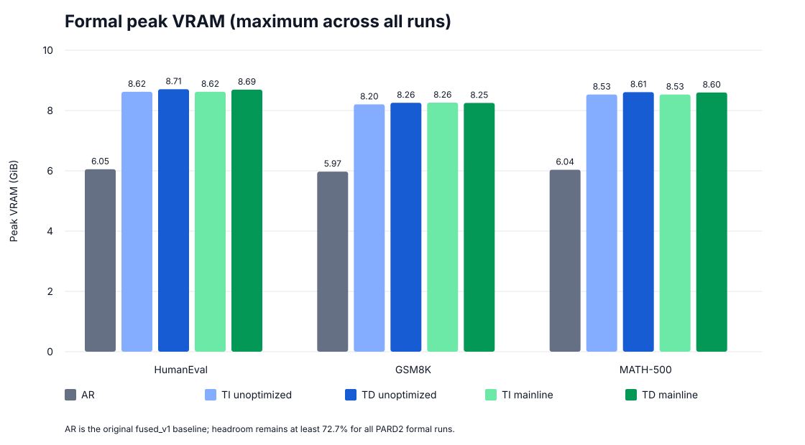
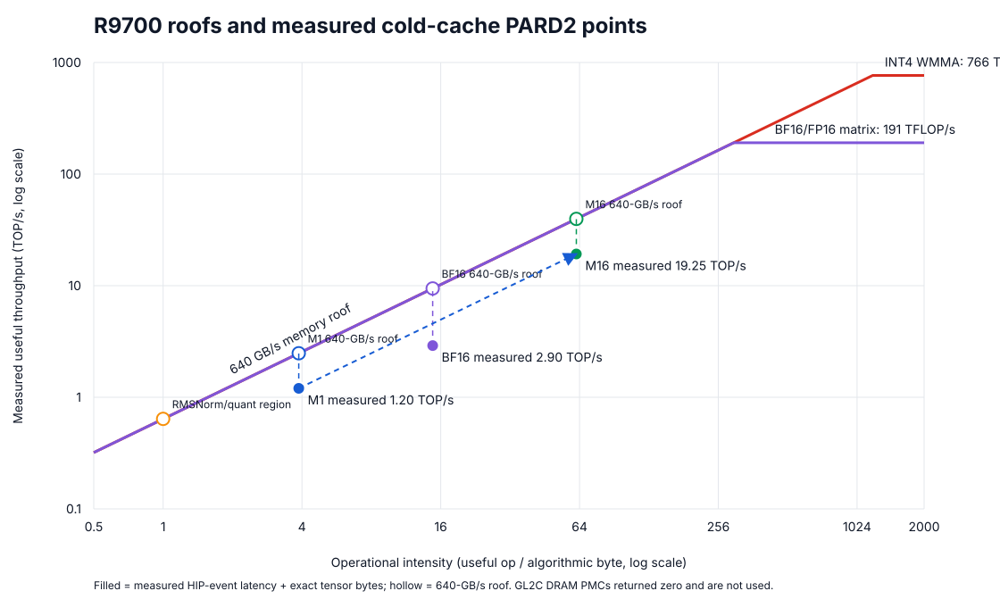

# 從 Parity Baseline 到可採用主線：fused_v1 × PARD2 最佳化教程

> 適用讀者：接手其他推論最佳化方向，需要理解如何從 profile、提出假設、設計 ablation，到決定是否進入主線的研究組員。
>
> 本文承接 `PARD2_INTEGRATION_TUTORIAL_ZH.md`。起點是已通過 exact greedy parity 的 Qwen3-8B PARD2-TI/TD；終點是目前採用的「batched LM-head + cached TD basis」主線，以及沒有採用的實驗為何被保留或停止。

## 1. 最佳化不是「讓某個 kernel 變快」

Speculative decoding 的效能同時由兩件事決定：

1. 每輪能產生多少正確 token，也就是 acceptance；
2. 完成一輪 draft + verify + cache commit 要花多少時間。

可以用一個粗略模型理解：

```text
effective throughput
    ≈ 每輪實際輸出的 token 數
      / (draft cost + verifier cost + feature/cache/runtime overhead)
```

因此：

- drafter 變快但 acceptance 大降，E2E 可能更慢；
- target kernel 變快，但 AR 受益比 PARD2 更多，speculative/AR speedup 反而縮小；
- FLOPs 變少，但 shape 變動造成 recompile 或小矩陣效率變差，仍可能負收益；
- aggregate TPS 上升，但 paired samples 不穩定，不能採用。

這次工作的價值，在於把這些判斷變成可重複的研究流程，而不只是一串 kernel patch。

## 2. 最佳化前先定義採用 gate

每一項變更都保留獨立 flag，先通過以下條件才可能成為預設：

### 2.1 Correctness

- target output token exact parity；
- 相關 kernel 的 packed data、scale、KV 或 logits parity；
- acceptance 不回歸，或在事先允許的範圍內；
- cache transaction 與下一 token 對 fresh recomputation。

### 2.2 Performance

- paired median latency/throughput 改善至少 3%；
- CV 小於 5%；
- 不能把首次 `torch.compile` 時間混入 warmed steady state；
- 必須看 E2E，不只看 isolated kernel 或某個 stage。

### 2.3 System constraints

- peak VRAM 不回歸，至少保留 10% headroom；
- AR、TI、TD 正式比較使用同一 target configuration；
- 維護成本要和收益相稱；
- 負向結果也要保留可重現 flag 與數據。

3% 不是物理定律，而是這個專案用來抵抗量測 noise、工具鏈變動與維護成本的工程門檻。若一項複雜變更只有 0.5%，下一版 ROCm 或不同 GPU 很容易把它吃掉。

## 3. 量測方法：避免「看起來變快」

### 3.1 Paired 比 aggregate 更重要

Prompt acceptance 差異很大。同一模式在高 acceptance prompt 可能 70 tok/s，在低 acceptance prompt 只有 30 tok/s。若兩次 run 的 prompt ordering 或 compile 污染不同，直接比較 aggregate median 很容易誤判。

我們用相同 `(sweep, prompt_index)` 配對，再計算 ratio：

```text
ratio[prompt, sweep] = candidate TPS / baseline TPS
```

採用判斷以 paired median 與 CV 為主。

### 3.2 Compile 污染要單獨處理

PARD2 drafter 有多個 bounded proposal shapes。即使有 persistent Inductor cache，第一次遇到某些 shape 仍可能重新專門化。這會讓 sweep 0 出現數十秒甚至數分鐘的 outlier。

正確做法是：

- 原始 sweep 全部保留，不修改 JSON；
- 明確標註 compile-polluted samples；
- warmed 決策使用後續 sweeps；
- candidate logging 與 throughput run 分開，避免 `.tolist()` 或同步污染計時。

### 3.3 Stage timing 是用來解釋，不是取代 E2E

Stage breakdown 可以回答收益來自 draft、target verify、prefill 或 feature path；但只有 E2E 能決定是否採用。例如某個 target stage 下降 5%，若它只占一小部分 step，E2E 可能不到 1%。

## 4. Phase 1：保留 row parity，同時拆掉不必要的 rowwise 成本

這個階段容易被一句「改用 row-independent RMSNorm，再把 LM-head batch 起來」帶過，但真正重要的是三次設計轉折：

```text
逐 row M=1 correctness oracle
        ↓
一次 launch、固定 row arithmetic 的 RMSNorm
        ↓
只保留必要的 row contract，LM-head 恢復 batched GEMM
```

理解這段演進，可以避免把 correctness fallback 誤當成最終 runtime，也能避免把不同最佳化的收益錯誤歸因。

### 4.1 第一步：用逐 row M=1 建立 correctness oracle

最初發現 M=16 verifier 與 sequential AR 偏離時，我們先把 `[M=16, D]` 拆成最多 16 個 `[M=1, D]`，讓每個 token row 都走與 AR 相同的 execution shape：

```text
[M=16, D]
    ↓ split
16 × [M=1, D]
    ↓ 分別執行 RMSNorm
concat → [M=16, D]
```

這個做法不是理想的最佳化，而是很強的 diagnostic oracle。當它讓 parity 恢復時，就能證明問題來自跨 `M` 的 execution arithmetic，而不是 candidate alignment、acceptance rule 或 cache transaction。

代價也很直接：

- 一次 RMSNorm 變成最多 16 次 kernel launches；
- 當時 LM-head 也被保守地連帶拆成逐 row M1 linear；
- launch、dispatch 與同步成本增加；
- verifier 原本應利用的 batched `M=16` 平行度被部分抵銷。

所以逐 row M1 的價值是回答「哪裡不等價」，不是作為最終主線。

### 4.2 第二步：用 row-independent HIP RMSNorm 取代逐 row launches

後來新增的 `rms_norm_rows` 在一次 kernel launch 中建立 `M` 個相同的 row workgroups：

```text
one kernel launch
├── workgroup 0  → row 0
├── workgroup 1  → row 1
├── ...
└── workgroup 15 → row 15
```

每個 workgroup 都固定：

- thread/workgroup geometry；
- 每個 thread 負責的 hidden columns；
- vector load mapping；
- partial sums 的 grouping；
- warp/shared-memory reduction tree。

因此 `M` 只決定 grid 中有多少個 row programs，不再改變單一 row 內部的算術順序：

```text
RMSNorm(row_i inside M=1)
    ==
RMSNorm(row_i inside M=16)
```

這裡追求的是 bitwise execution contract，不只是數學公式中的 rows 互相獨立。實際 oracle 驗證包括：

- M=16 與 16 次 M1 bit-exact；
- verifier logits/top-1 對 sequential AR；
- quantized activation 與 KV data/scales 一致；
- cache commit 後下一 token 對 fresh recomputation；
- HumanEval、GSM8K、MATH-500 的 AR/TI/TD exact greedy parity。

它把「16 次 launch 才能 exact」改善成「一次 launch 同時處理 16 rows，仍然 exact」。

### 4.3 第三步：把 RMSNorm correctness 與 LM-head batching 解耦

早期 `exact_small_chunk` 把兩個行為綁在一起：

```text
row-independent/逐 row RMSNorm
+
rowwise LM-head
```

逐 tensor 診斷後，我們得到不同結論：

- RMSNorm reduction order 會影響 W4A4 量化邊界，因此固定 row arithmetic 是 parity 必要條件；
- LM-head 的 batched 與 rowwise 路徑在完整 logits、top-1 與輸出 tokens 上一致，沒有必要拆成 M1。

所以設定被拆成：

- `exact_row_norm=True`：主線必要；
- `rowwise_lm_head=False`：主線使用 batched LM-head；
- `exact_small_chunk`：只保留為舊版相容 alias。

目前主線的資料流是：

```text
RMSNorm:
    one launch + fixed arithmetic for every row

LM-head:
    [M, hidden_dim] → one batched vocabulary GEMM
```

Checkpoint、cache、acceptance rule 與 drafter 都沒有改動，因此 rowwise/batched LM-head 是乾淨的單變因 ablation。

### 4.4 為何 batched LM-head 能有大收益

LM-head 的輸出 dimension 是完整 vocabulary。拆成最多 16 次 M1 不只增加 launch 次數，也讓 GEMM geometry 無法利用 batched `M`。成本並非只由 FLOPs 決定，還包括 dispatch、kernel occupancy、memory reuse 與矩陣 shape。

Small-chunk hidden rows 一次送入 LM-head GEMM 後，可以保留 verifier 的 batched execution。這也是為何收益明顯大於只節省幾個輕量 elementwise kernels。

### 4.5 結果，以及正確的收益歸因

TI、MATH prompts 14–16、128 tokens、2 warmups、3 sweeps：

| 指標 | Rowwise | Batched | 改善 |
|---|---:|---:|---:|
| Steady | 20.8066 tok/s | 27.4252 tok/s | **+31.81%** |
| E2E | 20.5926 tok/s | 26.9288 tok/s | **+30.77%** |
| Verify median | 4099.06 ms | 3041.05 ms | **−25.81%** |
| Mean accept | 4.48276 | 4.48276 | 不變 |
| Token parity | 9/9 | 9/9 | exact |

這裡的約 31% 是**移除 rowwise LM-head** 的收益，不是 row-independent RMSNorm 本身加速了 31%。RMSNorm 的主要成果是恢復跨 `M` parity；batched LM-head 才是本次 measured speedup 的來源。

### 4.6 仍存在的 trade-off

固定每個 row 的 execution geometry，表示 RMSNorm 不能針對每個 `M` 任意選擇最快但 reduction tree 不同的 specialization。這是一個清楚的取捨：

```text
犧牲部分 shape-specific freedom
換取 M=1/4/8/16 共用的 exact arithmetic contract
```

後續曾實作 fused norm–quant，嘗試把 RMSNorm 與 activation INT4 packing 合成一個 kernel，以降低 intermediate traffic 和 launch cost。它通過 packed bytes、scales、tokens 與 acceptance parity，但對 TD 的 E2E 只改善約 1.33%，未達 3% 採用門檻，因此仍預設關閉。

目前主線最後形成：

```text
row-independent RMSNorm = on   # 跨 M exact parity
batched LM-head         = on   # 回收主要 rowwise overhead
fused norm–quant        = off  # TD E2E 收益未達 gate
```

### 4.7 採用理由與研究啟示

Batched LM-head 收益大、變更範圍小，而且 acceptance 不變，因此採用為預設。Trade-off 是未來若更換 LM-head kernel、ROCm 或 shape dispatch，仍須重跑完整 logits parity，不能只假設 batched linear 永遠等於逐 row linear。

這個案例的研究重點不是「把所有 rows batch 起來」，而是先找出哪些 operators 對 reduction order 敏感：

- 對 arithmetic contract 敏感的 RMSNorm，使用固定 row mapping；
- 已證明 batch-safe 的 LM-head，恢復 batched execution；
- 很慢但可靠的逐 row M1 路徑，保留為 correctness oracle。

研究啟示：**先找 parity 階段留下的保守 fallback，再逐 operator 證明哪些限制可以移除。它們常是最安全、收益最大的最佳化來源。**

## 5. Phase 2：TD feature runtime 的三個假設

TD acceptance 高於 TI，但需要四個 target taps。直覺上，feature restore 與 projection 很可能是主要 overhead。我們把這個直覺拆成三個可獨立測試的假設。

### 5.1 候選 A：cached basis

Parity baseline 每輪會把 rotation signs 與 original final-norm gamma 轉到 target device/dtype。這些 tensor 在整次 generation 都不變，重複 materialization 沒有必要。

實作：`SelectedHiddenCollector.cache_basis()` 在 runtime 初始化時完成 device/dtype placement；之後每輪直接重用。

結果：

- steady paired median `1.05357×`；
- E2E paired median `1.04857×`；
- CV `2.95%`；
- 9/9 token parity；
- mean accept length 不變。

這項變更通過 gate，`td_cache_basis=True` 成為預設。

### 5.2 候選 B：lazy accepted rows

假設：verifier 產生最多 16 rows，但若只接受少數 token，就不必 restore 全部 features。可以等 acceptance 決定後，只處理實際 emitted rows。

實作需要小心第一輪 alignment：

- 第一輪要保留 prompt 最後一個 feature；
- collector rows 是 `emitted_count - 1`；
- 後續輪 rows 是 `emitted_count`；
- EOS/max-token 截斷後要依實際 emitted 長度切片。

結果相對 Phase 1 baseline 雖仍有小幅正收益，但弱於 cached-only。原因是 slicing、控制流程、不同 row shapes 與較差的小 M 效率吃掉了省下的 Hadamard 工作。

決策：保留 `td_lazy_features` 實驗 flag，預設 false。

### 5.3 候選 C：unique-row projection

PARD mask rows通常重複最後一個 feature。理論上可以只投影 unique real rows，再在 projected space expand mask rows。

FLOPs 確實下降，但實測 warmed draft median由 539.13 ms 增為 617.42 ms，paired E2E ratio 只有 `0.94497×`，反而慢約 5.5%。

原因包括：

- 動態 row shape 破壞固定 shape compile 優勢；
- 小 M projection 的 GPU 使用率較差；
- projection 移出已最佳化 graph；
- expand/slicing/control overhead 變得可見。

決策：`td_unique_projection=False`。

### 5.4 Phase 2 的核心教訓

**少算 FLOPs 不等於少花時間。** 在小 batch GPU inference 中，固定 shape、launch 數量、graph 邊界與矩陣 geometry 往往比理論運算量更重要。

## 6. Phase 3：把 inverse Hadamard 摺進 projection weight

### 6.1 為何這個想法合理

TD legacy path 對四個 rotated taps 做 inverse Hadamard/sign restore，再送進線性 projection。線性 transform 可以代數合併，因此考慮把 basis restore 離線摺進 `target_proj.weight`。

QuaRot row-vector convention 為：

```text
x_rot = x D H
```

其中 `D` 是 rotation signs，`H` 是 normalized symmetric Hadamard。對 projection block `W_i`，摺疊後：

```text
W'_0 = W_0 Γ D H       # final normalized tap
W'_i = W_i D H         # 三個 intermediate taps
```

`Γ` 是 target 原始 final RMSNorm gamma。

### 6.2 一個容易犯的錯：final tap 不能抓錯位置

Intermediate layers 可直接使用 raw rotated outputs。但 final tap 涉及 RMSNorm 非線性：

```text
RMS(x) = x / sqrt(mean(x²) + eps)
```

RMS 操作不能摺進線性 weight。因此 folded path 必須 hook `target.model.norm` 的輸出，再把 gamma/sign/Hadamard 摺進 weight；若仍抓 final layer 的 pre-norm output，代數不成立。

### 6.3 實作

- 啟動時在 CPU FP32 blockwise transform weight；
- 不建立 4096×4096 dense Hadamard matrix；
- 只修改記憶體中的 projection，不改 checkpoint；
- cast 回 drafter BF16；
- double-fold guard；
- raw feature calibration 與 fold 同時啟用時明確拒絕；
- legacy path 保留為 oracle；
- `td_basis_fold` 預設 false。

### 6.4 數學等價為何仍可能改 acceptance

Legacy 路徑是「activation 做 FP16/BF16 Hadamard與 rounding，再 GEMM」；folded 路徑是「FP32 transform weight、cast BF16，再 GEMM」。實數代數等價，不代表有限精度 operation order 等價。

Eager prompt 14 曾觀察 mean accept `4.5714 → 4.0`，雖 max-autotune smoke 沒有重現。這提醒我們：target token parity 仍可能成立，drafter candidates 卻已改變。最佳化 TD features 時，不能只檢查最終輸出；還要看 candidate agreement 與 acceptance。

### 6.5 結果與決策

排除 sweep 0 compile 污染後：

- steady `1.00319×`；
- E2E `1.00491×`；
- acceptance `5.95254 → 5.95254`；
- 9/9 exact output parity；
- CV 約 4.4%；
- VRAM 約下降 0.2 MiB。

收益遠低於 3% gate，因此不採用。這個結果也修正了最初假設：inverse Hadamard 的確存在，但不是目前 TD E2E 的主瓶頸。

## 7. Phase 4A：exact RMSNorm–INT4 fusion

### 7.1 動機

Parity 修復後，每個 target forward 有 36 layers × 2 個 layer norms，共 72 組：

```text
row-independent RMSNorm
    → dense FP16 output
    → abs/max/scale
    → signed INT4 pack
    → QKV 或 gate/up Linear4bit
```

若把 norm 與 quantization 合併，可以少寫/讀一次 dense normalized tensor，並減少 launches。Final model norm 接 LM-head，不接 INT4 consumer，所以保持 dense。

### 7.2 Bit-exact contract

融合 kernel 不能只讓 dequantized value 接近；必須讓 packed bytes 與 scales 完全一致。順序固定為：

1. FP16 input load，轉 FP32；
2. 和 `rms_norm_rows` 相同的 per-thread column traversal；
3. 相同 256-thread reduction tree；
4. `rsqrtf(sum/width + eps)`；
5. 先 round 成 normalized FP16；
6. 在這些 FP16 values 上求 `max(abs(x))`；
7. FP16 scale `/7`；
8. FP16 division、round-to-nearest、clamp `[-8,7]`；
9. low nibble first 的 signed INT4 packing。

若跳過第 5 步、直接用 FP32 normalized value 量化，數學上更精確，卻不再等於既有 target，可能破壞 parity。

### 7.3 Runtime wiring

`_RowIndependentRMSNormQuant` 回傳 `PackedQuantizedTensor`，附帶 `logical_shape`。Attention/MLP 從 logical shape 取得 B/S/H，quantizer 若收到 packed tensor就直接 passthrough，QKV 與 gate/up 共用一次 packed activation。

`--fused-norm-quant` 只允許：

- `exact_row_norm=True`；
- quantized target；
- CUDA FP16 input。

原始 norm + quantizer path 完整保留。

### 7.4 結果看似矛盾，其實很有教育性

| 模式 | Steady ratio | E2E ratio | 判讀 |
|---|---:|---:|---|
| AR eager | 1.10637× | 1.03397× | M1 target 明顯受益 |
| TI eager | 1.04896× | 1.05770× | 單 prompt smoke 通過 3% |
| TD max-autotune | 1.01031× | 1.01333× | 未通過全域 gate |

所有 packed bytes/scales、tokens 與 acceptance 都通過 parity；完整 suite 最終為 161 passed。

為何仍不設為預設？

- verifier M≈16 時，GEMM/attention 占比高，norm 節省被稀釋；
- AR M1 收益比 TD 更大；
- 若正式 AR、TI、TD 共用同一 target，開啟 fusion 可能讓 absolute TPS 都上升，卻縮小 PARD2/AR speedup；
- TD E2E 只增 1.333%，不足以抵銷跨 kernel/PackedTensor/runtime 的維護面；
- 這條實驗路徑沒有進入主線 formal qualification；正式主線仍保持 `fused_norm_quant=False`。

因此 `fused_norm_quant=False`，保留作 mode-specific 研究。

### 7.5 為何沒有再做 wave-tail reduction

另一個想法是保持 norm 與 quant 分離，只把 RMSNorm reduction tail 改成 wave shuffle，省幾個 workgroup barriers。它不會減少 launch、global traffic 或 allocation，預期收益比 norm–quant fusion更小。

更直接的 fusion 尚且只帶來 TD E2E 1.333%，因此沒有投入 architecture-specific wave32 路徑。這不是「做不到」，而是根據上界與維護成本停止。

## 8. Phase 4B：hidden-tap hook 真的是 TD 瓶頸嗎？

最初直覺是：TD 比 TI acceptance 高卻未拉開足夠速度，可能是四個 hidden hooks 太貴，應把 hooks 融入 target kernel。

但先看語意：tap 是 decoder layer 最後的 residual + MLP output。現有 QKV/FFN HIP kernel 並不擁有這個最終 tensor，因此不能簡單「把 Python hook 塞進 kernel」。真正 HIP fusion 需要進一步融合 down-projection dequant、residual add 與 side-channel，結構耦合很高。

我們先做三路 profiler：

```text
no hooks
4 no-op hooks
4 store-reference hooks
```

固定同一 target、input、cache logical length，使用 transaction rollback，q_len 1/16 各 30 samples。

結果：

| Shape | Store-ref 相對 no-hook median |
|---|---:|
| q_len=1 | −0.293%（noise） |
| q_len=16 | +0.0919% |

Logits/top-1 exact。Hook 成本低於 0.5%，根本不是值得解決的瓶頸。因此沒有進一步實作 wrapper capture、forked Qwen3 forward 或 HIP side-write。

研究啟示：**在設計侵入式 fusion 前，先量測你想消除的成本是否存在。** 架構上「看起來不漂亮」的 Python hook，不一定在 GPU-heavy forward 中有可見比例。

## 9. 最終主線與補充實驗

### 9.1 目前採用主線

| 項目 | 預設 | 理由 |
|---|---|---|
| Row-independent RMSNorm | on | exact chunk/AR contract 必要 |
| Batched LM-head | on | phase smoke E2E +30.77%；formal acceptance 變動小於 0.4% |
| Cached TD basis | on | E2E +4.86%，parity/acceptance 不變 |
| Native GQA KV4 | on | correctness 通過且避免 KV 展開 |
| Lazy TD features | off | 弱於 cached-only |
| Unique projection | off | E2E 約 −5.5% |
| TD basis fold | off | E2E +0.49%，未達 gate |
| Fused norm–quant | off | TD E2E +1.33%，未達全域 gate |
| Hidden-tap fusion | 未實作 | profiler overhead <0.5% |

### 9.2 其他曾嘗試但未進主線的方向

#### Feature calibration

舊 QuaRot runtime 的係數不能直接搬到 fused target，因量化與 hidden semantics 已不同。以新 runtime tune features 擬合 affine calibration 曾改善局部 steady，但沒有 E2E 淨收益，因此未採用。

#### W4A4 drafter

量化 drafter 理論上可降低 draft cost，但實際 candidate agreement/acceptance 不達 gate；曾出現 mean accept length 1.0、accepted draft tokens 為零。Drafter 快但完全不被接受，等同浪費一次 proposal forward。

#### M16 BPre geometry

局部 GEMM 有改善，但一個 prompt 的 E2E 不足 3%。保留實驗環境變數，不作預設。

#### Adaptive-k 與 graph capture

這兩項仍是合理的第二層研究方向，但沒有混入本輪核心架構結論。Adaptive-k 必須用 tune split 選參，formal split 凍結；graph capture 必須等 fixed shape 與 buffer lifecycle 更穩定後再評估。

## 10. 從 matched smoke 到主線 formal

最佳化完成初期，只有 MATH prompts 14–16 的 matched smoke。它量到 TD steady `1.898× AR`、E2E `1.801× AR`，適合回答「方向是否值得繼續」，但不適合當最終跨資料集結論。

後續已補齊 HumanEval 80、GSM8K 80、MATH-500 20 的 TI/TD 主線正式程序，因此 smoke 數字只保留為研究過程，不再作為目前配置的主要引用值。完整正式比較放在本文最後一節。

### 10.1 AR baseline 的精確定義

分母沿用 parity qualification 時的 fused_v1 AR formal results，沒有開啟任何後續 performance optimization，例如 fused norm–quant。Batched LM-head 只作用於 M>1 verifier，cached TD basis 只作用於 TD，所以都不會改變這份 AR baseline。

Row-independent RMSNorm 仍保持開啟，因為它是讓 AR M=1 與 verifier M≤16 共用相同 arithmetic semantics 的核心 correctness contract，不被歸類為後續效能最佳化。這項定義避免為了得到更大的 speedup，偷偷換成較慢或不同 token semantics 的分母。

## 11. 如何為下一個最佳化方向設計實驗

以下流程可以直接套用到新的 kernel、cache、drafter 或 scheduling 想法。

### Step 1：寫出成本假設

不要只說「這裡應該很慢」，而要說明：

```text
哪個 stage？每輪幾次？處理多少 bytes/FLOPs？
理論上最多能降低整體多少百分比？
```

若某 stage 只占 E2E 0.5%，就不值得先做高風險重構。

### Step 2：建立 oracle 與 rollback flag

新路徑必須能和舊路徑同程序或 matched runs 比較。Flag 預設先關閉；只有通過 gate 才翻轉 default。

### Step 3：先做最小 correctness diagnostic

依變更類型選擇：

- kernel：packed bytes/scales/KV exact；
- target execution：layer output/logits/top-1；
- drafter：candidate agreement/acceptance；
- cache：每個 accepted length 後 fresh recomputation；
- scheduling：output tokens 與 logical cache length。

### Step 4：跑 paired smoke

固定 prompts、tokens、warmups、sweeps 與 process isolation。記錄 stage breakdown，但採用看 E2E。遇到 compile outlier 不刪資料，而是標註並補 warmed samples。

### Step 5：判斷是否值得 formal

只有 smoke 同時滿足：

- correctness；
- acceptance/quality；
- median ≥3%；
- CV <5%；
- VRAM；
- 維護成本合理；

才進 80/80/20 formal。這能避免為一個負向方案花數小時完整 qualification。

### Step 6：結果不論正負都寫出原因

負向結果至少回答：

- 假設哪一部分不成立；
- 成本被什麼抵銷；
- 哪些條件改變後值得重試；
- flag、結果檔與 oracle 在哪裡。

這能防止下一位組員半年後重做同一個失敗實驗。

## 12. 程式與結果地圖

### 主線 runtime

- `e2e/speculative.py`：flags、feature path、runtime、timing；
- `e2e/benchmark_pard2.py`：paired benchmark contract；
- `quarot/kernels/fused_hip.hip`：row norm、norm–quant 與其他 fused kernels；
- `quarot/nn/quantization.py`、`e2e/quantized_common.py`：packed activation consumer；
- `e2e/profile_td_hook_overhead.py`：hook 成本診斷。

### 核心結果

- `pard2_optimization_results/phase1/`：rowwise vs batched LM-head；
- `pard2_optimization_results/phase2/`：cached/lazy/unique ablations 與 current AR smoke；
- `pard2_optimization_results/phase3/`：basis folding；
- `pard2_optimization_results/phase4/`：norm–quant 與 hook profiler；
- `pard2_optimization_results/qualification_phase1_recheck.json`：既有 formal 結果重新驗證。
- `pard2_optimization_results/formal_mainline/`：主線 TI/TD 三資料集 raw formal JSON；
- `pard2_optimization_results/formal_mainline/qualification_mainline.json`：主線對原始 fused_v1 AR 的 parity、CI、CV、VRAM 與 gate。
- `e2e/analyze_pard2_memory_roofline.py`：由 raw formal JSON 重建 VRAM 摘要與兩張圖；
- `e2e/profile_pard2_measured_roofline.py`：cold-cache HIP-event 30-sample measured roofline runner；
- `pard2_optimization_results/measured_roofline_summary.json`：latency samples、CV、OI、throughput 與 algorithmic bandwidth；
- `pard2_optimization_results/roofline_profile_measured/`：rocprofv3 cold-cache trace 與 GL2C counter probe。
- `pard2_optimization_results/memory_roofline_summary.json`：memory、roofline 假設與 microbenchmark 的機器可讀摘要；
- `pard2_optimization_results/roofline_profile_probe/`：gfx1201 INT4 M=1/M=16 的原始 rocprofv3 trace。

### Regression

最終完整 `pytest -q tests`：`161 passed`，只有既有 Triton deprecation warnings。

## 13. 結論：採用的是證據鏈，不只是 patch

目前主線只多採用 batched LM-head 與 cached TD basis。這看似保守，實際上代表每個 default 都有完整證據鏈：問題定位、單變因實作、parity、acceptance、paired E2E、CV、VRAM 與 rollback。

Basis folding、lazy rows、unique projection、norm–quant 與 hidden fusion 都提供了有價值的研究資訊：瓶頸不一定在理論 FLOPs 最多或程式碼最顯眼的位置。下一位研究者最應延續的，不是某個特定 kernel 寫法，而是這套「先建立共同 contract，再用 paired evidence 決定主線」的方法。

## 14. 最終正式結果：未優化 PARD2、主線與 fused_v1 AR

最後把整合期未優化 PARD2 與目前主線放在同一張表。Formal contract 為 batch 1、greedy、每 prompt 最多 256 generated tokens、正常遵守 EOS、8 個非計分 warmups、3 sweeps；HumanEval/GSM8K 各 80 prompts，MATH-500 為 20 prompts。每個 mode/dataset 都在獨立程序執行。

表中的三個 speedup 都是先以相同 `(sweep, prompt)` 配對，再對 steady-decode TPS ratio 取 median：

```text
未優化 / AR = unoptimized PARD2 TPS / original fused_v1 AR TPS
主線 / AR   = mainline PARD2 TPS / original fused_v1 AR TPS
主線 / 未優化 = mainline PARD2 TPS / unoptimized PARD2 TPS
```

因此它們不是兩個 aggregate median TPS 的相除。Mean accept 則是所有正式 runs 的 `mean_accept_length` 算術平均。

| Dataset | Mode | 未優化 / AR | 未優化 mean accept | 主線 / AR | 主線 / 未優化 | 主線 mean accept | Output parity |
|---|---|---:|---:|---:|---:|---:|---|
| HumanEval | TI | 1.667× | 5.968 | 2.252× | 1.340× | 5.960 | exact |
| HumanEval | TD | 1.921× | 6.696 | 2.569× | 1.336× | 6.721 | exact |
| GSM8K | TI | 2.361× | 5.450 | 2.678× | 1.199× | 5.445 | exact |
| GSM8K | TD | 2.802× | 6.373 | 3.252× | 1.201× | 6.365 | exact |
| MATH-500 | TI | 1.586× | 5.536 | 2.040× | 1.295× | 5.555 | exact |
| MATH-500 | TD | 1.743× | 6.517 | 2.255× | 1.275× | 6.497 | exact |

主線相對未優化 PARD2 的 paired steady 改善為：

- HumanEval：TI `+34.0%`、TD `+33.6%`；
- GSM8K：TI `+19.9%`、TD `+20.1%`；
- MATH-500：TI `+29.5%`、TD `+27.5%`。

這些預設項目原本就不是用來提高 acceptance。正式結果中 mean accept 的最大相對變動小於 0.4%；batched LM-head 改變有限精度 operation grouping，可能讓極少數 proposal step 不同，但六組最終 output token 仍和原始 AR、未優化 PARD2 完全一致。因此最佳化效益應解讀為「相同演算法工作做得更便宜」，而不是「靠接受更多 token 取得加速」。

若關心包含 TTFT 的整體體感，主線 paired E2E 結果如下：

| Dataset | Mode | 主線 E2E / AR | 主線 E2E / 未優化 |
|---|---|---:|---:|
| HumanEval | TI | 2.117× | 1.324× |
| HumanEval | TD | 2.507× | 1.351× |
| GSM8K | TI | 2.550× | 1.186× |
| GSM8K | TD | 3.141× | 1.208× |
| MATH-500 | TI | 1.939× | 1.278× |
| MATH-500 | TD | 2.216× | 1.282× |

主線六組皆為 exact parity；對 AR 的 steady speedup bootstrap 95% CI 下界均大於 1.0，run-level CV 最大為 4.816%，VRAM headroom 最低仍有 72.7%，所以 hard gate 全數通過。TD 相對官方 Qwen3 參考的 stretch gate 仍未通過：系統已明確快於 fused_v1 AR，也證明兩項主線最佳化在三資料集都有效，但距離文獻級完整系統效率仍有研究空間。

## 15. Memory 表現與 compute-bound / memory-bound 分析

速度只回答「跑得多快」，沒有回答它用多少容量、搬多少資料，以及下一步該優化算術還是資料移動。本節分成三種證據：VRAM 是 formal run 實測值；roof/ ridge 是硬體峰值推導；實心 kernel 點則是 cold-cache 真實 latency 與精確 algorithmic tensor bytes 的組合。三者不可混稱。

### 15.1 Formal peak VRAM

下表的 peak 是該 dataset/mode 全部 formal runs 中最大的 `peak_vram_bytes`，不是單一漂亮 sample，也不是空程序載入後的模型大小。Headroom 以每個 formal JSON 記錄的實際 total VRAM `34,208,743,424 bytes` 計算。

| Dataset | 原始 fused_v1 AR | 未優化 TI | 未優化 TD | 主線 TI | 主線 TD | 最低 headroom |
|---|---:|---:|---:|---:|---:|---:|
| HumanEval | 6.053 GiB | 8.621 GiB | 8.708 GiB | 8.621 GiB | 8.694 GiB | 72.67% |
| GSM8K | 5.973 GiB | 8.205 GiB | 8.256 GiB | 8.261 GiB | 8.251 GiB | 74.07% |
| MATH-500 | 6.036 GiB | 8.531 GiB | 8.608 GiB | 8.531 GiB | 8.597 GiB | 72.98% |



相對原始 fused_v1 AR，主線 TI 多使用 `2.29–2.57 GiB`，TD 多使用 `2.28–2.64 GiB`，約為 AR peak 的 `38–44%`。主要來源不是 speculative transaction metadata，而是額外的 BF16 drafter、TD projection/features，以及 proposal/verification 的常駐工作 buffer。即使如此，最差 case 仍有 72.67% headroom，因此 batch 1 qualification 的容量 gate 很寬裕；這不代表之後可不量 batch serving，因為 KV cache 會隨 batch 與 context 成長。

Cached TD basis 主要消除每一步重建、配置、搬移與同步，而非移除一個大型常駐模型。主線 TD 相對未優化 TD 的最大 peak 只下降：HumanEval `14.36 MiB`、GSM8K `4.80 MiB`、MATH-500 `11.98 MiB`。這解釋了它能改善 E2E，卻不會在 GiB 圖上形成明顯落差。TI 的小幅跨程序差異也應視為 allocator/high-water-mark noise 與工作 buffer lifecycle，而非新演算法配置出數百 MiB。

容量與頻寬要分開看：上表證明「裝得下」，不能據此說 kernel 不是 memory-bound。是否 memory-bound 要看每搬一 byte 能完成多少有效運算。


### 15.2 Roofline 的硬體與計算假設

本機是 gfx1201、64 CU 的 Radeon AI PRO R9700。依 [AMD 官方規格](https://www.amd.com/en/products/graphics/workstations/radeon-ai-pro/ai-9000-series/amd-radeon-ai-pro-r9700.html)，峰值為 32 GB GDDR6、640 GB/s、FP16 matrix 191 TFLOP/s、INT4 matrix 766 TOPS。對應 ridge point 為：

```text
FP16/BF16 matrix ridge = 191,000 / 640 = 298.4 FLOP/byte
INT4 WMMA ridge        = 766,000 / 640 = 1,196.9 op/byte
```

ridge 左側受 memory roof 限制，右側才有機會 compute-bound。這裡必須使用 INT4 ceiling，因為 `gemm_hip.hip` 的主路徑確實呼叫 gfx12 `wmma_i32_16x16x32_iu4`，不是一般 FP16 vector ALU。

對 W4A4 linear，忽略 activation、output、scale 與 cache 額外流量時：

```text
有效運算量約 2 M K N op
W4 weight 至少 0.5 K N byte
OI 上限約 4M op/byte
```

因此 logical M=1 的 useful OI 最多約 4 op/byte；M=16 verifier/LM-head 最多約 64 op/byte。兩者都遠低於 1,196.9 op/byte，額外流量只會把真實點往左移，所以主 linear 在本 workload 明確位於 memory side，而非 INT4 compute roof。



空心點是相同 OI 在 640 GB/s 下的 memory-roof 參考；實心點是 cold-cache HIP-event latency 換算的 measured useful throughput。縱向虛線就是實測與理想頻寬 roof 的落差。圖仍保留峰值線來判斷 compute/memory side，但不再把估算點當成量測結果。


### 15.3 各 stage 的瓶頸分類

| Stage | OI/硬體特徵 | 判定 | 對最佳化的含意 |
|---|---|---|---|
| AR target W4A4 linear | logical M=1，useful OI ≤4；實際 pad 成 16-row WMMA tile | memory/低有效利用率 | 不能只調 WMMA arithmetic；應提高同一次 weight traversal 的有效 rows |
| M≤16 verifier 與 batched LM-head | useful OI ≤64 | 仍 memory-bound，但比 AR 有約 16× useful reuse | batching 是正確方向，也是本輪最大收益來源 |
| BF16 drafter/projection，M≈15 | weight-dominated OI ≤15 FLOP/B，遠低於 298.4 | memory-bound | projection 合併、weight reuse、避免重複 basis/materialization 比提高 FLOPs 更重要 |
| KV4 decode attention | context 增長時反覆讀 K/V，算術強度低 | memory-bandwidth/latency-bound | native GQA、KV4、不展開 KV heads 可直接減少 bytes |
| RMSNorm + quantize | OI 約 order 1–3，且有兩次 reduction | global-memory、reduction 與 launch-bound | fusion 可省 traffic/launch，但占整體比例小，所以正式 gate 未採用 |
| Hadamard transform | global bytes 不大，但反覆 LDS/register shuffle/barrier | on-chip-memory/synchronization-bound | wave shuffle 對小固定寬度有效；不能用 DRAM roofline 單獨解釋 |
| Cache transaction/metadata | 幾乎沒有 dense arithmetic | latency/launch-bound | 預配置與覆寫 stale slots，避免 allocation 與 host sync |

「memory-bound」也不是單一種類。W4 weights 與長 context KV 是 global bandwidth 問題；Hadamard/RMS reduction 常是 LDS、barrier 或 occupancy；小 metadata kernel 則可能是 launch latency。把它們全部稱為 DRAM-bound，會導向錯誤的 kernel 設計。

### 15.4 M=1 與 M=16 的 gfx1201 trace

Python wrapper 會把 logical M=1 pad 到一個 16-row WMMA tile，最後只保留第一 row；batched LM-head 則讓同一 tile 的 16 rows 都成為有效 logits。用 `QUAROT_ENABLE_M16_BPRE=1`、相同預打包 weight 做 rocprofv3 kernel trace：

| W4A4 shape `(K,N)` | logical M=1 median | M=16 median | M16 / M1 |
|---|---:|---:|---:|
| (4096, 4096) | 38.000 µs | 37.940 µs | 0.998× |
| (4096, 12288)，Qwen3 FFN shape | 32.020 µs | 32.400 µs | 1.012× |

這不是完整 layer/E2E latency，而是 `bpre_kernel<1,4,1,2>` dispatch；仍足以驗證關鍵機制：16 個有效 rows 幾乎只花一個 padded AR tile 的 kernel 時間。Batched LM-head 的收益因此不只是抽象的「提高 occupancy」，而是回收 AR 路徑本來就執行、卻被丟掉的 15 rows。


### 15.5 Measured cold-cache roofline

為避免 warm cache 把 24–32 MiB weights 留在較近的 cache，每個 sample 前先用 512 MiB buffer 驅逐 cache，再以 HIP events 計時；5 warmups、30 samples。Algorithmic bytes 精確包含該 kernel 的 input、weight 與 output tensor footprint。它不是 PM counter 的實際 DRAM transactions，但 latency、throughput 與 CV 都是真實執行值。

| Stage | Algorithmic OI | Median（p10–p90） | Measured throughput | Algorithmic BW | 640 GB/s roof utilization | CV |
|---|---:|---:|---:|---:|---:|---:|
| W4A4 logical M=1 | 3.874 op/B | 83.680 µs（82.360–84.640） | 1.203 TOPS | 310.53 GB/s | 48.52% | 1.02% |
| W4A4 M=16 | 61.982 op/B | 83.680 µs（82.360–84.640） | 19.247 TOPS | 310.53 GB/s | 48.52% | 1.02% |
| BF16 TD projection M=15 | 14.770 FLOP/B | 173.380 µs（171.720–185.310） | 2.903 TFLOP/s | 196.54 GB/s | 30.71% | 2.92% |
| Fused RMSNorm–quant 16×4096 | 不以單一 FLOP 定義 | 16.380 µs（16.320–16.600） | 不畫 TOPS 點 | 10.00 GB/s | 不適用 | 6.00% |

M=1 與 M=16 使用相同 physical 16-row WMMA tile 和相同 measured latency；差別是 M=1 只把一 row 算作 useful operations，而 M=16 保留全部 rows。因此實測 useful throughput 由 1.203 提高到 19.247 TOPS，正是 batched LM-head 的硬體證據。兩個點的 algorithmic bandwidth 相同，也證明加速來自提高每次 weight traversal 的有效工作量，而不是突然得到更高 DRAM 頻寬。

BF16 projection 只利用約 30.7% algorithmic memory roof，表示除了 weight traffic，仍有 rocBLAS geometry、launch、cache hierarchy 與小 M utilization 的損失。它離 191 TFLOP/s compute ceiling更遠，因此仍不能解讀為 compute-bound。

rocprofv3 的衍生 `FETCH_SIZE` 與底層 `GL2C_EA_RDREQ_128B` 在這組 gfx1201/ROCm 7.2 上都對非零 8/24 MiB operands 回傳 0，所以無法宣稱取得 hardware-counter DRAM bytes。本節的 `Algorithmic BW` 是「精確 tensor bytes / measured time」；真實 DRAM transactions 可能因 cache line、重讀與 writeback 不同。原始失敗 counter probe 仍保留，未來 profiler 支援修復後可直接把相同 runner 升級成 PM-counter measured roofline。

### 15.6 對下一步研究的直接建議

依這份分類，優先順序應是：先增加 verifier/LM-head/drafter 的跨 row weight reuse，再減少 KV/feature bytes 與 temporary materialization，接著才處理 launch、barrier 與小型 fusion。只有當 operational intensity 接近 ridge，或 profiler 顯示 WMMA busy 已成主要限制時，才值得把重心轉向純 compute kernel tuning。

在容量面，batch 1 不緊張；下一個有資訊量的 memory 實驗不是繼續省十幾 MiB basis，而是做 `(context length, draft_k, batch)` 的 peak-VRAM 曲線，拆出 target KV、draft cache、transaction buffer 的斜率。這能直接回答何時 72% headroom 會被 serving workload 吃完。
